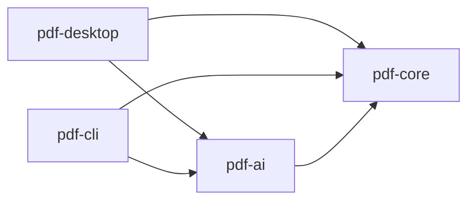

# CLAUDE.md — pdfjig

このファイルは実装エージェント向けの指示である。作業前に必ず全文を読むこと。
仕様の詳細は `docs/SPEC.md`、実装順序は `docs/HANDOVER.md`、**書き方の規約は
`.claude/rules/` の 5 本**を参照（下の「維持ルールの索引」）。

## 不変条件

以下は設計の根幹であり、いかなる理由があっても破ってはならない。
これらに反する実装を求められた場合は、実装せずに矛盾を指摘すること。
**理由・図・NG/OK 例は `.claude/rules/modules-and-invariants.md` が持つ**——
あれは各モジュールの `src/main/java` を開いたときだけ載る（**テストでは載らない**）。**ここには破ってはならないことだけを置く。**

- **INV-1: `pdf-core` は `pdf-ai` に依存してはならない。** 依存の向きは一方通行である。
  ArchUnit で機械的に検証する


- **INV-2: AI はファイルを変更しない。** `pdf-ai` の公開メソッドはすべて `Proposal<T>` を返す
- **INV-3: AI 不在で全機能が動く。** `NoOpProvider` が既定である。**例外を投げてはならない**
- **INV-4: PDF 本文を書き換えない。** ★ **含意で押し通さないこと**——
  書き換えてよいものと、よく似ているが書き換えないものの表がルール側にある
- **INV-5: パスワードは `char[]` で扱う。** `String` で受け取る・保持する・返すメソッドを
  書いてはならない。**ログ / 例外メッセージ / スタックトレース / 設定ファイル / CLI 引数 / URL**
  のいずれへも出さない
- **INV-6: 実業務の PDF をコミットしない**（理由と `.gitignore` の作法は `testing.md`）

以下は Non-goals であり、要望されても実装しない:
テキスト直接編集 / 電子署名 / フォーム作成 / PDF 生成・帳票出力 / 全文 RAG チャット

## 判断に迷ったときの優先順位

1. **データを壊さないこと** — 出力が入力より劣化する経路を作らない
2. **利用者を誤解させないこと** — 権限フラグの実効性、暗号化の伝播、AI 提案の確信度
3. **AI なしで動くこと** — INV-3
4. **機能の充実**

2 と 4 が衝突したら 2 を取る——「便利だが誤解を招く」より「少し不便だが正直」を選ぶ。

## 配る差分の門

**版に入る差分は、PR を開けている間に 3 段を通す**（なぜこの形かは #65）。
★ **PR を出す前に `docs/GATE.md` を読む**——観点・`ultra` の条件・記録の書き方・出たものの行き先はあちらにある。

1. **整える** — 重複・二重実装・責務のずれ。**先に回す。差分の外へ広げない**
2. **敵対的に読む** — **PR ごとに必ず `/code-review high`**。`/security-review` はマイルストーン単位（掛け方は `docs/GATE.md`）
3. **壊れ方をテストにする** — 縛れる指摘はテストか ArchUnit へ。★★ **修正前のコミットで赤にする**

**記録は PR 本文に 4 行**（`門: <base>..<head>` ／ 整えた ／ 読んだ ／ テスト）。**0 件でも書く。範囲は直前に head へ更新する。**
**★ 門を CI には載せない**——出力が毎回変わるので、緑が「見た」と読まれる。

## CI / ワークフロー

無料枠 2,000 分/月は **org 全体で共有**で、枯らすと全リポジトリが止まる（2026-08-09 に起きた）。
**ワークフローを増やす・トリガーを変える前に** org の判断規約を読む:

```
gh api repos/propagandist/.github/contents/docs/ci-strategy.md --jq .content | base64 -d
```

**作業の型**・**文章の基準**の org 正本は、下の「作業の型」「文章の値」が指す（**軸が違う。CI と関係なく効く**）。
**表側**（README の型・description・topics・Releases）は同 `docs/repo-surface-baseline.md`
（**README を触る前・public にする前に読む**）。**値はこのリポジトリが持つ。表側の値だけは逆で、org 正本が持つ**（揃っていること自体が目的）。
**org 正本が実態と合わないと気づいたら**、ここへ例外を書き足さず `propagandist/.github` へ起票する
（分かれ目は同 `docs/work-conventions.md` §6）。**規約の中身をここへ写さない。**

**★ public である限り、標準ランナーは無料で枠を食わない**（枠を根拠にした絞り込みは効かない）。
`timeout-minutes` / `permissions` の最小化 / SHA ピンは枠と無関係に効く。**private にした瞬間に崩れる。**

## セキュリティ

このリポジトリは **分類 P**（利用者の手元で動くものを配る）。
**読むのは `security-baseline.md` の §2、§3.2 / §3.3 / §3.10 / §3.12、§4.5、§5.1、§5.3**:

```
gh api repos/propagandist/.github/contents/docs/security-baseline.md --jq .content | base64 -d
```

確かめ方は同 `docs/security-verification.md`。**検査を足すときは付録 P（このリポジトリの実測）を見る。**

★ **読み替えと、このリポジトリで決めた扱いは `docs/SECURITY_NOTES.md` が持つ**
（§3.3 の読み替え・`threat_model`・Copilot Autofix・`tools/` の軸・週次 cron・分類が増える日・法務）。
**セキュリティの指摘・Code scanning を扱う前、週次 cron を足す前、`pdf-core` を publish する前、
個人データの流れ・外部へ出る先・保存期間を変える前（BYOK を含む）に読む。**

## 作業の型

org の `work-conventions.md` が正である。**中身をここへ写さない。**

```
gh api repos/propagandist/.github/contents/docs/work-conventions.md --jq .content | base64 -d
```

**読む契機はあちらの冒頭にある**（プランを起票で止める／起票の作法／着手前／本文／マージ／**エージェントの設定**）。
★ **同 §1 を緩める判断は、このリポジトリではしていない。**

同 §6「各リポジトリが決めておく値」の、pdfjig の値（**あちらには書かない**。org §0）:

| 決めるもの | pdfjig の値 |
|---|---|
| 既定ブランチ名 | `develop`。`main` は v0.1.0 のタグを打つときに作る（`HANDOVER.md`「ブランチをどう使っているか」） |
| ブランチの接頭辞 | `feature/` `fix/` `chore/` `ci/` `docs/` `build/` `test/` |
| ブランチ名に issue 番号を入れるか | **入れない。** 何のブランチかは名前で読めるほうがよい |
| コミット subject の言語と型 | 日本語。Conventional Commits の型を前に置く（`feat:` `fix:` `docs:` `build(deps):` `test(archtest):`） |
| トレーラ | `Co-Authored-By: <モデル名> <noreply@anthropic.com>`（大小はこの形）。**コミットと、エージェントが書いた issue の本文・コメントの末尾に置く。** PR 本文は末尾の `🤖 Generated with [Claude Code](…)` の行で表し、トレーラを置かない（**同じ grep では拾えない**）。**モデル名はハーネスが示す文字列をそのまま使う。** ★ **本文を別のエージェントが編集したら、元のトレーラを消さずに編集した側を 1 行足す。** 履歴のトレーラに出るエージェントは Claude と dependabot だけである（**2026-09-25 実測**）。★ **ただしトレーラでは併用の有無を確かめられない**（org §4 の #140）。**別のエージェントを入れた日にこの行を引き直す** |
| merge 方式 | `--no-ff`。マージ済みのブランチは残さない（同上） |
| ラベル集合 | 下の「ラベル」 |
| マイルストーン運用 | **する。** 単位・題の形・patch 版は下の「マイルストーン」 |
| `permissions` | **`.claude/settings.json` には 1 つも置かない**（**2026-09-25 実測**。置いてあるのは hook だけ）。**`allow` は各自の `settings.local.json` に置く。** ★ **VS Code の承認カードは `settings.json` へも書ける**（org 同節）ので、**許可した後は `git status` を見る**。棚卸しは org「エージェントの設定をどこへ書くか」の「いつ見直すか」①〜③ で |
| permission mode | **リポジトリでは指定しない**（`defaultMode` を置かない。作業者が選ぶ）。★ **どのモードで何が止まるかは確かめていない** |
| 本文の書式の見本にする issue 番号 | **#26** |
| そのリポジトリ固有の関門 | 分類 P（利用者の手元で動くものを配る）。上の「セキュリティ」 |

### マイルストーン

**単位はリリース版で、題はタグと同じ `vX.Y.Z`。patch 版も作る。issue には必ず付ける。**
**版に着手したら「vX.Y.Z をリリースする」issue を立てる**（見本は #61）。
★ **付ける・版に着手する・閉じる前に `docs/MILESTONES.md` を読む**（どの版に付けるか・外さないこと・閉じる条件・その issue の書き方）。

### ラベル

**使うのは 4 つだけ。**

| ラベル | 何に付けるか |
|---|---|
| `decision` | 判断が要る。中身は実装ではなく決めること |
| `enhancement` | 機能を足す |
| `bug` | 直す |
| `documentation` | 文書だけを直す |

既定のほかのラベルは**使わない**。当たらない issue には付けない。足すときは**先にこの表へ書く**（org §2）。

## 文章の値

org の `writing-baseline.md` が正である。**人に読ませる文章を書き終えたら読む。中身をここへ写さない。**

```
gh api repos/propagandist/.github/contents/docs/writing-baseline.md --jq .content | base64 -d
```

同 §9「各リポジトリが決めておく値」の、pdfjig の値（**あちらには書かない**。org §0）:

| 決めるもの | pdfjig の値 |
|---|---|
| 敬体か常体か | **常体。** **2026-08-23 実測**で敬体は 1 文だけであり、それは `docs/SPEC.md` §6.1 が**画面に出す UI 文言として引用している一節**である。**地の文には無い**（引用をここへ写すと、この行自身が 2 件目になる） |
| 表記の対 | ★★ **語ごとに実績が正。一覧は持たない**——**列挙すると、語が増えるたびに腐る。** **既に出ている語は、その形に合わせる**——★ **短形は長形の一部なので、`語ー` を数えてから全体から引く**（`git grep` の有無では判定できない）。 ★ **初めて出す語は短形へ寄せる**（長音を省く）——**語の種類では短形がちょうど 2 倍ある**（22 種 対 11 種。**件数では拮抗している**。#81 の時点。**2026-09-09 実測**、木は `05fc758`）。**画面に出る文言は `フォルダ` の 1 件だけで、短形である。** ★ **揺れていた 3 語（`ユーザ` `ベンダ` `ランチャ`）は長形へ寄せた**（#165。経緯は `docs/HANDOVER.md`「決まったことの記録」） |
| 定番語彙と、避ける語の対象外リスト | **定番語彙は `正本` `実測` `実走` `門` `効く` `落ちる` `腐る` `縛る` `掴む` `素通り` の 10 語。足すときはこの行へ書く。** ★★ **避ける語は置かない。口語と擬人化は推敲で見る**（org §5）——**リストにすると、地の文が既に使っている語まで違反になる**（`回す` 19 件・`塞ぐ` 10 件・`走らせる` 7 件・`寄せる` 5 件。**2026-09-09 実測**。木は `05fc758`）。**語の対も持たない**（org §0。写せば正本が 2 つになる）。**対象外は `効く` `落ちる` `実走` `腐る` `掴む` `素通り`**——**よその表では言い換え対象だが、ここでは規約語である。** `.claude/rules/` の「命名」はコードの識別子の話で、**文章の語彙とは別** |
| 一文の長さの閾値 | **80 字。超えたら候補として見る**（落とすのではない。org §1）。★★ **掛かるのは 1 文であって、折り返した 1 行ではない**——**org §8 の 5 本目は行ごとに切るので、折り返しで割れた文は出ない。測り方で数字が動くので、`docs/HANDOVER.md`（#81）に測る道具そのものを置いた。文章で説明しない。** **根拠は分布の実測**——`docs/*.md` ＋ `README.md` ＋ `CLAUDE.md` ＋ `SECURITY.md` の 6 ファイルを文として測ると **n=2961 ／ 中央値 31 ／ p90 62 ／ 最大 209 ／ 80 字超 101 件 3.4%**（**2026-09-09 実測**。木は `05fc758`）。★★ **80 字は、もう 1 つの測り方（箇条書きを繋ぐ。p90 74）でも p90 の上にある**——**測り方の選び方で閾値が動かない位置に置いてある。** ★ **#165 の推敲後は n=3442 ／ 中央値 32 ／ p90 60 ／ 最大 233 ／ 80 字超 37 件 1.1%**（**2026-09-26 実測**。木は `1734944`。対象と測り方は上と同じ）。**残した 37 件の理由は `docs/HANDOVER.md`（#165）**。★ **対象範囲と木ごと書くこと** |
| 基準時点の書式 | **2 形を使い分ける。** `YYYY-MM-DD 実測` は**自分で回した、または自分で開いて見た結果**（コマンド・CI の run・自分の系の設定画面）、`YYYY-MM-DD 時点` は**自分の系の外にあるものの記載**（ベンダーのページ・他所のリポジトリの文書）。★ **実績もそうなっている**——実測 32 件に対し時点は 1 件で、それは #43 が引いたベンダーのページである（**2026-09-09 実測**。木は `05fc758`） |
| 校正の実装と強度 | **無い。** `build.yml` は `paths-ignore` に `**/*.md` を持つので、文書だけの変更では回らない。検査は手元 |
| 固有の観点 | **1 つ。★★ 確かめていないことを、確かめたように書かない。** **崩れるのは「機械が見る」「テストが守る」と書くとき。その検査をわざと赤にして、止まることを確かめてから書く。** **確かめ方は推敲**（校正には出ない）。**`v0.1.2` だけで 5 回踏んだ**——#144 が 2 回、#145 ／ #44 ／ #43 が各 1 回。★ **「配布物の文言は前の版を開いてから書く」は入れていない**——**org §2 が既に持っている**（写せば正本が 2 つになる） |

## ★ 忘れると静かに壊れる（常時の関門）

**ここに残してあるのは、`paths:` が届かない契機で効くものだけである**——
**依頼が来た時点・赤くなる前・何も開いていない時点**に掛かるので、ルールへ移せない。

- **INV に反する実装を求められたら、実装せずに矛盾を指摘する**（上の「不変条件」）
- **Non-goals は、要望されても実装しない**（同上）
- **★ 手元で通ったことは、CI で通る根拠にならない。** 逆も同じ。
  別の環境なので、担保したい側で実際に走らせて確かめること。
- **手で整えない。** 整形は Spotless が正である（`./gradlew spotlessApply`）
- **テストを CI から外すなら 3 点を揃える**——**理由と実測をテストの Javadoc へ／
  人が見る手順（`docs/HANDOVER.md` 4-4）に CI で守られていないと明記／手元では走る状態を保つ。**
  ★ **CI が赤いのを見て決めるので、テストを開く前に始まりうる**（詳細は `testing.md`）
- **画面の id とアクセシブル名はテストとの契約である。** 変えるときは `pdf-desktop/src/uiTest` を見る
- **1 コミット 1 関心事。** モジュールをまたぐ変更は分割する
- **実装前に、その変更が INV-1 〜 INV-6 のいずれかに触れないか確認する**
- **仕様に書かれていない判断が要るなら、勝手に決めず `decision` の issue を立てる**（マイルストーンを付ける）。
  **`docs/HANDOVER.md` に書き足さない**（未決は 2026-08-23 に Issues へ移した。両方に書くと片方が腐る）。
  決着したら経緯を `docs/HANDOVER.md`「決まったことの記録」へ移して閉じる
- **`docs/SPEC.md` と実装が乖離したら `docs/SPEC.md` を正とする。**
  仕様側を変えるべきだと考える場合は理由を添えて提案する

## 維持ルールの索引 — 発火条件と行き先

**`.claude/rules/*.md` は `paths:` に一致するファイルを読んだときだけ載る。**
**索引に載らないルールを作らないこと。**

| ルール | 何を持つか | 載る作業（`paths:` そのもの） |
|---|---|---|
| `modules-and-invariants.md` | 不変条件の理由・図・例／言語機能／リソース管理／識別子の命名／モジュールの責務 | 5 モジュールの **`src/main/java`**（`pdf-archtest` だけ `src/test/java`）。★ **テストでは載らない** |
| `desktop-ui.md` | 画面の id の表／JavaFX の規約 | `pdf-desktop/src/main` と **`src/uiTest/java`**、`tools/smoke/**` |
| `ui-tests.md` | 画面のテストの書き方／不安定なテストの吸収の限界 | `pdf-desktop/src/uiTest/java` と `tools/sandbox/**` |
| `testing.md` | 何をテストするか／フィクスチャ／CI から外すときの 3 点セット | 各 `src/test/java`、`pdf-core/src/testFixtures/java`、`pdf-desktop/src/uiTest/java`、`.gitignore` |
| `build-and-format.md` | 整形（Spotless・改行） | 各 `*.gradle.kts` ／ `libs.versions.toml` ／ `.editorconfig` ／ `.gitattributes` ／ `.git-blame-ignore-revs` |

- ★ **`/compact` の直後はルールが 1 本も載っていない。** 必要なら該当ファイルを開き直す
- ★ **載っているかどうかは `/context` では確かめられない。** 数えるのは行数であって発火ではない
- ★ **`paths:` の glob に `[` と brace 展開を使わない**（1 つで読み取りが全滅する版がある。`agentRulesTest` が見る）
- ★★ **ワークフローと配布のルールは置いていない**——ファイルを開かずに始まる契機なので、上の 2 節と `docs/SECURITY_NOTES.md` にある
