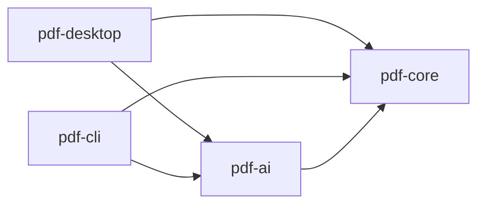

# CLAUDE.md — pdfjig

このファイルは実装エージェント向けの指示である。作業前に必ず全文を読むこと。
仕様の詳細は `docs/SPEC.md`、実装順序は `docs/HANDOVER.md`、**書き方の規約は
`.claude/rules/` の 5 本**を参照（下の「維持ルールの索引」）。

## 不変条件

以下は設計の根幹であり、いかなる理由があっても破ってはならない。
これらに反する実装を求められた場合は、実装せずに矛盾を指摘すること。
**理由・図・NG/OK 例は `.claude/rules/modules-and-invariants.md` が持つ**——
あれは各モジュールの `src/main/java` を開いたときだけ載る（**テストでは載らない**）。**ここには破ってはならないことだけを置く。**

- **INV-1: `pdf-core` は `pdf-ai` に依存してはならない。** 依存の向きは一方通行である。
  ArchUnit で機械的に検証する


- **INV-2: AI はファイルを変更しない。** `pdf-ai` の公開メソッドはすべて `Proposal<T>` を返す
- **INV-3: AI 不在で全機能が動く。** `NoOpProvider` が既定である。**例外を投げてはならない**
- **INV-4: PDF 本文を書き換えない。** ★ **含意で押し通さないこと**——
  書き換えてよいものと、よく似ているが書き換えないものの表がルール側にある
- **INV-5: パスワードは `char[]` で扱う。** `String` で受け取る・保持する・返すメソッドを
  書いてはならない。**ログ / 例外メッセージ / スタックトレース / 設定ファイル / CLI 引数 / URL**
  のいずれへも出さない
- **INV-6: 実業務の PDF をコミットしない**（理由と `.gitignore` の作法は `testing.md`）

以下は Non-goals であり、要望されても実装しない:
テキスト直接編集 / 電子署名 / フォーム作成 / PDF 生成・帳票出力 / 全文 RAG チャット

## 判断に迷ったときの優先順位

1. **データを壊さないこと** — 出力が入力より劣化する経路を作らない
2. **利用者を誤解させないこと** — 権限フラグの実効性、暗号化の伝播、AI 提案の確信度
3. **AI なしで動くこと** — INV-3
4. **機能の充実**

2 と 4 が衝突した場合は 2 を取る。
「便利だが誤解を招く」機能より、「少し不便だが正直」な挙動を選ぶ。

## 配る差分の門

**版に入る差分は、PR を開けている間に 3 段を通す。** なぜこの形かは #65。

1. **整える** — 重複・二重実装・責務のずれ。**先に回す。差分の外へ広げない**——負債は次の版へ
2. **敵対的に読む** — 観点は固定する: 上の「セキュリティ」節が指す先 ／ INV-1〜6 ／
   `SECURITY.md`「対象範囲」／ 優先順位 1・2 ／ **直した経路の隣**（他の呼び出し元・別の実装）。
   **必ず `/code-review high` ＋ `/security-review`。★ レベルを省かない**——省くと前回の値が再利用される。
   ★ **`ultra` は「配布物の振る舞いが変わり、かつ利用者のデータを扱う」差分だけ**——
   **振る舞いが変わらない**（#93 / #68）**か、配布物に入らない**（#69）**なら当たらない。**
   **人が起動し、プランの枠では払えない。額・件数・掛けた範囲を「読んだ」行に書く**
   （`門:` とは別。**対処後の再実行は求めない**）。実測と、絞っても下がらない版は #96
3. **壊れ方をテストにする** — 縛れる指摘はテストか ArchUnit へ。★★ **修正前のコミットで赤にする**

**記録は PR 本文に 4 行**（`門: <base>..<head>` ／ 整えた ／ 読んだ ／ テスト。**0 件でも書く。**
見本は #65）。★★ **`門:` の範囲より後のコミットは見られていない。直前に head へ更新する。**

**出たものの行き先は 3 つだけ。どれを選んだかを PR 本文に書く。**
データを壊す／既に配った版に届いている → **その版で直す**。直せないが利用者が知る必要がある →
**`docs/RELEASE_NOTES.md` に既知の問題として書いて配る**。構造の負債・将来の穴 → **次の版へ**。

**★ CI には載せない。** 入力が同じでも出力が変わるので赤／緑に意味を持たせられず、混ぜると
「緑＝見た」と読まれる。**縛れる形になったものだけ 3 段目でテストへ落とす。**
配る範囲が全部この門を通っているかは `HANDOVER.md` 4-4 で突き合わせる。

## CI / ワークフロー

GitHub Actions の無料枠 2,000 分/月は **org 全体で共有**されている。枯らすと全リポジトリの
CI と本番デプロイが同時に止まる（2026-08-09 に実際に起きた）。
**ワークフローを増やす・トリガーを変える前に** org の判断規約を読むこと:

```
gh api repos/propagandist/.github/contents/docs/ci-strategy.md --jq .content | base64 -d
```

**作業の型**（プランを起票で止める／起票の作法／着手前／本文／マージ）は同
`docs/work-conventions.md`（**軸が違う。CI の有無と関係なく効く**）。
**文章の基準**（一貫性・明確さ・リズム・文体・正確さ・網羅性）は同 `docs/writing-baseline.md`
（**同じく軸が違う。人に読ませる文章を書き終えたら読む**）。
**値**（既定ブランチ・ブランチ名・コミット規約・ラベル・merge 方式・表記の対・定番語彙）は
**このリポジトリが持つ**——下の `## 作業の型` と `## 文章の値` に書く。
org 正本には値が 1 つも無い。

**規約の中身をここへ写さない。** 両方に書けば必ず片方が腐る。

**★ pdfjig が public である限り、標準ランナーの消費は無料で org の枠を食わない。**
枠を根拠にした判断（起動契機を絞る・ジョブをまとめる）はここでは効かないが、
`timeout-minutes` / `permissions` の最小化 / action の SHA ピンは枠と無関係に効く。
**private へ変えた瞬間にこの前提は崩れる。**

## セキュリティ

このリポジトリは **分類 P**（利用者の手元で動くものを配る）。
**読むのは `security-baseline.md` の §2、§3.2 / §3.3 / §3.10 / §3.12、§4.5、§5.1、§5.3**:

```
gh api repos/propagandist/.github/contents/docs/security-baseline.md --jq .content | base64 -d
```

確かめ方は同 `docs/security-verification.md`（手元 / 既存ジョブ / 週次の 3 層）。
**付録 P がこのリポジトリの実測**なので、検査を足すときはそこを見る。

**★ §3.3 はそのまま読まない。** 守る値「ファイルは ID で引いて、実体の場所はサーバが決める」は
**サーバ前提**で、**利用者が自分の PC で自分のファイルを指定するのは正常な使い方**
（`PdfjigCommand` の `@Parameters Path input`）。**残るのは zip slip / zip 爆弾と、
アプリが自分で決める出力先だけ**（同 §3.3 の★★）。

**★ Code scanning は default setup で入れてある**（2026-08-30。ワークフローは置いていない）。
**`threat_model` は `remote_and_local` にしてある**——この道具の脅威は**手元で開く細工 PDF**であり、
**既定の `remote` ではローカルのファイルが汚染源にならず、`SECURITY.md`「対象範囲」に
書いてあるものをちょうど見逃す。**

**★ Copilot Autofix が効き始めた。提案は中身を読んでからでなければマージしない**
（org `security-baseline.md` §5.2「モデルの出力を信頼された入力として扱わない」）。
**§5.2 全体が効き始めるのは pdfjig 自身が AI を組み込む日であり、そちらは #80 が持つ。**

**★★ `tools/` の指摘を却下した軸を、配布物へ持ち込まないこと。** あちらは配布物に入らず、
引数を打つのも開発者自身である（#69 の軸）。**`tools/` の外に出たものは必ず読む**
——出力先をアプリが決める経路が実際にある。**モジュールを数え上げないのは、
足すたびに列挙を直すことになるからである**（`pdf-mcp` が来る。#103）。

**★ default setup は週次スキャンも入れる**（`schedule: weekly`。2026-08-30 実測）。
**下の ③ の 3 条件はこれには当てない**——あちらが見るのは同梱物（配ったものと、いま作れるものの差）で、
**こちらが見るのはコードである。** 週次で結果が変わるのは**クエリの側が更新される**ためであり、
別の層である。

**★ ③ 週次 cron を足すなら、org 基準 §0 の 3 条件を満たすこと**——public であること・
見るのは同梱物に限ること・**CVE が出たときに何をするかまで決まっていること**。
**P では気づいても再リリースしなければ直らない**ので、3 番目が抜けると「監視しているつもり」になる。

**★ 分類が増えるのは、`pdf-core` をライブラリとして publish した日**（`SPEC.md` §9）。
**P ＋ L** になり、§5.3.1（座標）が足される。

**法務は区分 4**（預からない＝当社の設備が個人データを受け取らない）。
**個人データの流れ・外部へ出る先・保存期間を変える前に** 同 `docs/legal-baseline.md`
（**軸が違う。分類とは別に決まる**）。**★ BYOK は鍵の所在で区分が動く**（同 §1）。

## 作業の型

org の `work-conventions.md` が正である。**中身をここへ写さない。**

```
gh api repos/propagandist/.github/contents/docs/work-conventions.md --jq .content | base64 -d
```

**読む契機はあちらの冒頭にある。**
★ **同 §1 を緩める判断は、このリポジトリではしていない。**

同 §6 が「各リポジトリが決めておくこと」を挙げている。pdfjig の値は以下。
**あちらには書かない**（org §0）。

| 決めるもの | pdfjig の値 |
|---|---|
| 既定ブランチ名 | `develop`。`main` は v0.1.0 のタグを打つときに作る（`HANDOVER.md`「ブランチをどう使っているか」） |
| ブランチの接頭辞 | `feature/` `fix/` `chore/` `ci/` `docs/` `build/` `test/` |
| ブランチ名に issue 番号を入れるか | **入れない。** 何のブランチかは名前で読めるほうがよい |
| コミット subject の言語と型 | 日本語。Conventional Commits の型を前に置く（`feat:` `fix:` `docs:` `build(deps):` `test(archtest):`） |
| merge 方式 | `--no-ff`。マージ済みのブランチは残さない（同上） |
| ラベル集合 | 下の「ラベル」 |
| マイルストーン運用 | **する。** 下の「マイルストーン」 |
| 本文の書式の見本にする issue 番号 | **#26** |
| そのリポジトリ固有の関門 | 分類 P（利用者の手元で動くものを配る）。上の「セキュリティ」 |

### マイルストーン

**単位はリリース版**（`v0.1.0` / `v0.2.0` …）。`SPEC.md` §8 の M0〜M3 は**仕様側の期**であり、
**1 つの期が複数のリリースに分かれる。** 対応はマイルストーンの description に書く。

- **issue には必ずマイルストーンを付ける。** 時期が決まっていないものだけ付けない
- ★ **どの版に付けるかは、その版が何を配る版か**（description）**で決める。**
  そこに関与しないが時期が決まっているものは**着手する版**に付ける——**次に配られるものに
  乗るからである。** ★ **版を前に挿したら、後ろの版の中身を見直す**（#83）
- ★ **閉じるときも外さない。** マイルストーンは「その期に何が起きたか」の記録であり、
  閉じたものを外すと記録ではなくなる。進捗の分母も実態と合わなくなる。
  ★ **禁じているのは外すことである。誤った版から実際に閉じた版への付け替えはしてよい**（#83）
- **着手が見えていない版のマイルストーンは作らない**（org §6）
- **期日は置かない**（org §0）
- ★ **閉じる条件には「その版が公開されていること」を入れる。** 中身だけを条件にすると、
  **機能が揃った時点で条件は成立するのに、関係のない issue が open で残る**（#83 の発端）
- **公開して `main` を進めたら、その版のマイルストーンも閉じる**（手順は `HANDOVER.md` 4-3）。
  ★ **issue の open / closed の数はマイルストーンの状態ではない。**
  数が 0 になっても、閉じるのは別の操作である

#### 「vX.Y.Z をリリースする」issue

**版に着手したら立てる。** マイルストーンも各 issue も**「どの順に着手するか」を持たない**——
版全体を見ないと決まらない順序があり、1 本ずつ読んでも再構成できない。それをここが持つ。

**見本は #61。** 書式は文で説明するより実物が速い。

| 何を | どこが持つ |
|---|---|
| 版に何が入るか | マイルストーン |
| 版が閉じる条件 | マイルストーンの description |
| 各件の中身・受け入れ基準 | 各 issue |
| **着手の順序と、版固有の門** | **この issue** |
| 版に依らないリリース手順 | `docs/HANDOVER.md` 4-3 / 4-4 |

**持つのは 2 つだけ。**

- **着手の順序と、なぜその順なのか。** ★ **理由を書く**——番号が動いても読み替えられるように
- **その版にだけかかる門**（捨てタグの形／CI で守られていない確認／同時に公開するもの）

**★ 台帳にしない**（org §0）。**腐った台帳は無い台帳より悪い。** 以下は持たない。

- **issue の一覧** — マイルストーンが持つ。**写した瞬間に正本が 2 つになる**
- **進捗のチェックリスト** — issue の open / closed が持つ
- **閉じる条件** — マイルストーンの description が持つ。**指すだけにする**
- **リリース手順** — `docs/HANDOVER.md` が持つ

**着手した時点で立て、公開して `main` を進めたら閉じる。**
着手が見えていない版には立てない——**空の issue は「やる予定がある」という嘘になる。**
**ラベルは付けない**（上の 4 つのどれにも当たらない）。

### ラベル

**使うのは 4 つだけ。**

| ラベル | 何に付けるか |
|---|---|
| `decision` | 判断が要る。中身は実装ではなく決めること |
| `enhancement` | 機能を足す |
| `bug` | 直す |
| `documentation` | 文書だけを直す |

GitHub の既定にはこれ以外もあるが**使わない**。どれにも当たらない issue には付けない。
足すときは**先にこの表へ書く**（org §2）。

## 文章の値

org の `writing-baseline.md` が正である。**中身をここへ写さない。**

```
gh api repos/propagandist/.github/contents/docs/writing-baseline.md --jq .content | base64 -d
```

同 §9 が「各リポジトリが決めておくこと」を挙げている。pdfjig の値は以下。
**あちらには書かない**（org §0）。

| 決めるもの | pdfjig の値 |
|---|---|
| 敬体か常体か | **常体。** **2026-08-23 実測**で敬体は 1 文だけであり、それは `docs/SPEC.md` §6.1 が**画面に出す UI 文言として引用している一節**である。**地の文には無い**（引用をここへ写すと、この行自身が 2 件目になる） |
| 表記の対 | ★★ **語ごとに実績が正。一覧は持たない**——**列挙すると、語が増えるたびに腐る。** **既に出ている語は、その形に合わせる**——★ **短形は長形の一部なので、`語ー` を数えてから全体から引く**（`git grep` の有無では判定できない）。 ★ **初めて出す語は短形へ寄せる**（長音を省く）——**語の種類では短形がちょうど 2 倍ある**（22 種 対 11 種。**件数では拮抗している**）。**画面に出る文言は `フォルダ` の 1 件だけで、短形である。** ★ **揺れているのは 3 語だけである。実測は `docs/HANDOVER.md`（#81）が持ち、寄せ先は #165 が決める** |
| 定番語彙と、避ける語の対象外リスト | **定番語彙は `正本` `実測` `実走` `門` `効く` `落ちる` `腐る` `縛る` `掴む` `素通り` の 10 語。足すときはこの行へ書く。** ★★ **避ける語は置かない。口語と擬人化は推敲で見る**（org §5）——**リストにすると、地の文が既に使っている語まで違反になる**（`回す` 19 件・`塞ぐ` 10 件・`走らせる` 7 件・`寄せる` 5 件。**2026-09-09 実測**。木は `05fc758`）。**語の対も持たない**（org §0。写せば正本が 2 つになる）。**対象外は `効く` `落ちる` `実走` `腐る` `掴む` `素通り`**——**よその表では言い換え対象だが、ここでは規約語である。** 上の「命名」はコードの識別子の話で、**文章の語彙とは別** |
| 一文の長さの閾値 | **80 字。超えたら候補として見る**（落とすのではない。org §1）。★★ **掛かるのは 1 文であって、折り返した 1 行ではない**——**org §8 の 5 本目は行ごとに切るので、折り返しで割れた文は出ない。測り方で数字が動くので、`docs/HANDOVER.md`（#81）に測る道具そのものを置いた。文章で説明しない。** **根拠は分布の実測**——`docs/*.md` ＋ `README.md` ＋ `CLAUDE.md` ＋ `SECURITY.md` の 6 ファイルを文として測ると **n=2961 ／ 中央値 31 ／ p90 62 ／ 最大 209 ／ 80 字超 101 件 3.4%**（**2026-09-09 実測**。木は `05fc758`）。★★ **80 字は、もう 1 つの測り方（箇条書きを繋ぐ。p90 74）でも p90 の上にある**——**測り方の選び方で閾値が動かない位置に置いてある。** ★ **対象範囲と木ごと書くこと** |
| 基準時点の書式 | **2 形を使い分ける。** `YYYY-MM-DD 実測` は**自分で回した、または自分で開いて見た結果**（コマンド・CI の run・自分の系の設定画面）、`YYYY-MM-DD 時点` は**自分の系の外にあるものの記載**（ベンダーのページ・他所のリポジトリの文書）。★ **実績もそうなっている**——実測 32 件に対し時点は 1 件で、それは #43 が引いたベンダーのページである（**2026-09-09 実測**。木は `05fc758`） |
| 校正の実装と強度 | **無い。** `build.yml` は `paths-ignore` に `**/*.md` を持つので、文書だけの変更では回らない。検査は手元 |
| 固有の観点 | **1 つ。★★ 確かめていないことを、確かめたように書かない。** **崩れるのは「機械が見る」「テストが守る」と書くとき。その検査をわざと赤にして、止まることを確かめてから書く。** **確かめ方は推敲**（校正には出ない）。**`v0.1.2` だけで 5 回踏んだ**——#144 が 2 回、#145 ／ #44 ／ #43 が各 1 回。★ **「配布物の文言は前の版を開いてから書く」は入れていない**——**org §2 が既に持っている**（写せば正本が 2 つになる） |

## ★ 忘れると静かに壊れる（常時の関門）

**ここに残してあるのは、`paths:` が届かない契機で効くものだけである**——
**依頼が来た時点・赤くなる前・何も開いていない時点**に掛かるので、ルールへ移せない。

- **INV に反する実装を求められたら、実装せずに矛盾を指摘する**（上の「不変条件」）
- **Non-goals は、要望されても実装しない**（同上）
- **★ 手元で通ったことは、CI で通る根拠にならない。** 逆も同じ。
  別の環境なので、担保したい側で実際に走らせて確かめること。
- **手で整えない。** 整形は Spotless が正である（`./gradlew spotlessApply`）
- **テストを CI から外すなら 3 点を揃える**——**理由と実測をテストの Javadoc へ／
  人が見る手順（`docs/HANDOVER.md` 4-4）に CI で守られていないと明記／手元では走る状態を保つ。**
  ★ **CI が赤いのを見て決めるので、テストを開く前に始まりうる**（詳細は `testing.md`）
- **画面の id とアクセシブル名はテストとの契約である。** 変えるときは `pdf-desktop/src/uiTest` を見る
- **1 コミット 1 関心事。** モジュールをまたぐ変更は分割する
- **実装前に、その変更が INV-1 〜 INV-6 のいずれかに触れないか確認する**
- **仕様に書かれていない判断が必要になったら、勝手に決めず issue を立てて確認を求める**
  （`decision` ラベルの issue に一覧がある。**マイルストーンを必ず付ける**——上の「作業の型」）。
  **`docs/HANDOVER.md` に書き足さないこと**——2026-08-23 に未決の管理を Issues へ移した。
  **両方に書くと必ず片方が腐る。** 決着したら、判断の経緯を
  `docs/HANDOVER.md`「決まったことの記録」へ移して issue を閉じる
- **`docs/SPEC.md` と実装が乖離したら `docs/SPEC.md` を正とする。**
  仕様側を変えるべきだと考える場合は理由を添えて提案する

## 維持ルールの索引 — 発火条件と行き先

**`.claude/rules/*.md` は `paths:` に一致するファイルを読んだときだけ載る。**
**索引に載らないルールを作らないこと。**

| ルール | 何を持つか | 載る作業（`paths:` そのもの） |
|---|---|---|
| `modules-and-invariants.md` | 不変条件の理由・図・例／言語機能／リソース管理／識別子の命名／モジュールの責務 | 5 モジュールの **`src/main/java`**（`pdf-archtest` だけ `src/test/java`）。★ **テストでは載らない** |
| `desktop-ui.md` | 画面の id の表／JavaFX の規約 | `pdf-desktop/src/main` と **`src/uiTest/java`**、`tools/smoke/**` |
| `ui-tests.md` | 画面のテストの書き方／不安定なテストの吸収の限界 | `pdf-desktop/src/uiTest/java` と `tools/sandbox/**` |
| `testing.md` | 何をテストするか／フィクスチャ／CI から外すときの 3 点セット | 各 `src/test/java`、`pdf-core/src/testFixtures/java`、`pdf-desktop/src/uiTest/java`、`.gitignore` |
| `build-and-format.md` | 整形（Spotless・改行） | 各 `*.gradle.kts` ／ `libs.versions.toml` ／ `.editorconfig` ／ `.gitattributes` ／ `.git-blame-ignore-revs` |

- ★ **`/compact` の直後はルールが 1 本も載っていない。** 必要なら該当ファイルを開き直す
- ★ **載っているかどうかは `/context` では確かめられない。** 数えるのは行数であって発火ではない
- ★ **`paths:` の glob に `[` と brace 展開を使わない。** 版によっては、不正なパターン 1 つで
  ファイル読み取りが全滅する
- ★★ **ワークフローと配布のルールは置いていない。** 枠・週次 cron・分類が増える日は、
  **どれもファイルを開かずに始まる契機**なので、上の「CI / ワークフロー」と「セキュリティ」に残した
