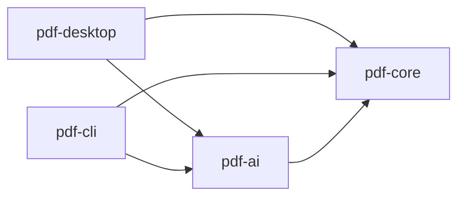

# pdfjig — 治具

PDF を「器」として扱うデスクトップユーティリティ。
複数の書類を綴じ、解き、中から情報を取り出す。**PDF の本文そのものは書き換えない。**

- ライセンス: Apache-2.0
- 対象プラットフォーム: Windows 10 / 11 (x64) — 初版
- 配布: GitHub Releases（jpackage による MSI / EXE）
- リポジトリ: https://github.com/propagandist/pdfjig

---

## 1. 設計思想

治具（じぐ）とは、加工物を正確な位置に固定し、同じ作業を誰がやっても同じ精度で繰り返せるようにする道具である。

このツールの設計原則もそれに従う。

1. **確定的処理が主、AI は従。** 座標・構造の解析は決定的アルゴリズムが行う。AI は意味的な整形を提案するだけで、確定的処理の結果を上書きする権限を持たない。
2. **AI は提案しかしない。** 分割・リネーム・整形はすべて「提案 → プレビュー → ユーザー承認 → 適用」の3段を経る。AI の出力が直接ファイルを変更する経路は存在しない。
3. **AI なしで完全に動く。** API キー未設定でも全機能が利用可能でなければならない。AI は増築であって土台ではない。
4. **中身は触らない。** ページの並べ替え・抽出・暗号化は行うが、PDF 本文のテキストやベクタ内容は改変しない。

---

## 2. スコープ

### 2.1 対象とするもの

| カテゴリ | 機能 |
|---|---|
| ページ操作 | 結合、分割、削除、並べ替え、回転、範囲抽出 |
| テキスト抽出 | 全文 / ページ単位 / 座標付き |
| 表抽出 | lattice・stream 両モード、矩形範囲指定 |
| 暗号化 | 設定、解除、判定、パスワード付きで開く |
| 文書情報 | メタデータ読み書き、ページ数、暗号化状態 |
| 出力 | CSV（BOM付き UTF-8）/ JSON / XLSX |
| AI 補助 | 表の正規化、文書境界検出、リネーム・分類、OCR 誤字補正 |

### 2.2 Non-goals（明示的に対象外）

以下は **要望が来ても実装しない**。README に明記する。

- **PDF 本文のテキスト直接編集** — 設計思想 4 に反する
- **電子署名・タイムスタンプ** — PKI 基盤・証明書チェーン管理が必要になり、製品の性格が変わる。ただし **署名の有無は検知し、書き出しで無効になることを警告する**。付与も検証もしないが、既にあるものを黙って壊すのは別の話である
- **フォームの作成** — フォームへの入力・値の読み取りは将来検討の余地があるが、作成は対象外
- **PDF の生成・帳票出力** — 既存の帳票ツールの領域
- **全文 RAG チャット** — 汎用 LLM ツールの領域であり、デスクトップアプリの優位性がない

この線引きは初版リリース時点で確定させる。後から「方針変更」として説明する事態を避けるため、空リポジトリの段階で README に記載する。

---

## 3. アーキテクチャ

### 3.1 モジュール構成

```
pdfjig/
├── pdf-core/      確定的処理。PDFBox / tabula-java / POI
├── pdf-ai/        LLM プロバイダ抽象化。提案を返すのみ
├── pdf-cli/       バッチ / CI 連携
└── pdf-desktop/   JavaFX UI
```

依存の向き:



**不変条件: `pdf-core` は `pdf-ai` に依存してはならない。** これは Gradle の依存宣言と ArchUnit テストの双方で強制する。この依存方向が崩れると設計全体が意味を失う。

### 3.2 技術選定

| 領域 | 選定 | ライセンス | 理由 |
|---|---|---|---|
| 言語 | Java 21 | — | 既存資産との整合。record / sealed / pattern matching を活用 |
| ビルド | Gradle (Kotlin DSL) | — | マルチモジュール構成 |
| PDF 基盤 | Apache PDFBox 3.x | Apache-2.0 | ページ操作・テキスト抽出・暗号化 |
| 表抽出 | tabula-java | MIT | lattice / stream 両対応。代替となる成熟実装が存在しない |
| Excel 出力 | Apache POI (SXSSF) | Apache-2.0 | ストリーミング API。XSSF は OOM の原因になるため使用禁止 |
| UI | JavaFX 21 | GPL+CE | jpackage との親和性 |
| パッケージング | jpackage (JDK 標準) | — | JRE 同梱の MSI / EXE |

**iText は使用しない。** AGPL であり、Apache-2.0 での公開と両立しない。

**Tauri / .NET を採用しなかった理由:** 表抽出の成熟した実装が Java にしか存在しない。Rust の PDF エコシステム（lopdf, pdf-extract）は抽出用途で実用水準に達しておらず、.NET には tabula 相当が存在しない。自前実装すると工数の大半をそこに費やすことになる。

---

## 4. pdf-core API

### 4.1 主要型

```java
// 文書ハンドル。AutoCloseable。パスワードは char[] で受け取る
final class PdfDocument implements AutoCloseable {
    static PdfDocument open(Path path);
    static PdfDocument open(Path path, char[] password);
    int pageCount();
    EncryptionInfo encryption();
    DocumentMetadata metadata();
}

// 暗号化状態
record EncryptionInfo(
    boolean encrypted,
    EncryptionAlgorithm algorithm,   // NONE, RC4_40, RC4_128, AES_128, AES_256
    boolean userPasswordRequired,
    AccessPermissions permissions
) {}

// 権限フラグ
record AccessPermissions(
    boolean print,
    boolean modify,
    boolean extractContent,
    boolean modifyAnnotations,
    boolean fillForms,
    boolean assembleDocument,
    boolean extractForAccessibility,  // 既定 true。塞ぐと支援技術で読めなくなる
    boolean printHighQuality
) {}
```

### 4.2 操作

```java
interface PageOperations {
    Path merge(List<Path> inputs, Path output, MergeOptions opts);
    List<Path> split(Path input, SplitStrategy strategy, Path outputDir);
    Path reorder(Path input, List<Integer> newOrder, Path output);
    Path rotate(Path input, Map<Integer, Rotation> rotations, Path output);
    Path extractPages(Path input, PageRange range, Path output);
    Path deletePages(Path input, PageRange range, Path output);

    // 並べ替え・削除・回転を一度の書き出しで確定させる
    Path assemble(Path input, List<PageSelection> selections, Path output);

    // 複数のファイルにまたがって集める。sourceIndex が inputs の並びを指す
    Path assemble(List<Path> inputs, List<PageSelection> selections, Path output);

    // 組み立てた並びを、かたまりごとに連番で書き出す
    List<Path> assembleEach(List<Path> inputs, List<List<PageSelection>> segments, Path outputDir);
}

// 出力に含める 1 ページの指定
record PageSelection(
    int sourceIndex,             // 出どころ。inputs の添字（0 始まり）
    int pageNumber,              // その文書の中でのページ番号（1 始まり）
    Rotation additionalRotation  // 元の回転角に加える回転。絶対角ではない
) {}

interface TextExtraction {
    String extractAll(PdfDocument doc);
    List<PageText> extractByPage(PdfDocument doc);
    List<PositionedText> extractWithPositions(PdfDocument doc, int pageIndex);
}

interface TableExtraction {
    List<RawTable> extract(PdfDocument doc, PageRange range, TableMode mode);
    List<RawTable> extract(PdfDocument doc, int pageIndex, Rectangle2D area, TableMode mode);
}
// TableMode: LATTICE（罫線あり）, STREAM（罫線なし）, AUTO

interface Encryption {
    EncryptionInfo inspect(Path input);
    Path protect(Path input, char[] userPassword, char[] ownerPassword,
                 AccessPermissions permissions, EncryptionAlgorithm algorithm, Path output);
    Path unprotect(Path input, char[] password, Path output);
}

interface Exporter {
    void export(List<RawTable> tables, Path output, ExportFormat format);
}
// ExportFormat: CSV, JSON, XLSX
```

**`pdf-core` は既存の出力を拒む**（`ErrorCode.OUTPUT_ALREADY_EXISTS`）。上のすべてのシグネチャにかかる契約である。上書きの判断は利用者のものであり、暗黙に行わない。この規約により、入力と同じパスを出力に指定して入力を壊す事故も同時に防がれる。

**`pdf-desktop` の「名前を付けて保存」は、その上に層を重ねる。** ネイティブの保存ダイアログが上書きを利用者に確認し、確認が取れてから一時ファイルへ書いて置き換える。**先に消すと、書き込みに失敗したときに元のファイルが失われる**ため、置き換えの形を採る。**分割は層を重ねず、`pdf-core` の約束のまま拒む**——複数のファイルを一度に作る操作であり、どれが置き換わるのかを 1 つずつ確認させる形にはしない。

**確認を出すのは OS のダイアログであり、pdfjig ではない。** したがって**上書き確認が出ていることを自動テストで確かめる手段が無い**（`FileDialogs` の向こう側。`CLAUDE.md`「JavaFX」）。人が見る手順の側に置いてある（`docs/HANDOVER.md` 4-4）。

**検査と書き出しの間の競合（TOCTOU）は見ない。** 既存かどうかを確かめてから書き出すまでの間に他のプロセスが作ったファイルは、黙って潰れる。`StandardOpenOption.CREATE_NEW` で原子的に弾く形は採っていない。**利用者の手元で動くデスクトップアプリであり、出力先を選ぶのも同じ利用者である**ため、そこは守る対象に入れない。この前提が変わるのは、`pdf-core` をライブラリとして publish したとき（§9）である。

**上書きを避けるための小細工はしない。** 連番（`foo(1).pdf`）への退避もバックアップ（`.bak`）の作成も行わない。

`assemble` は `reorder` / `rotate` / `extractPages` / `deletePages` を置き換えるものではない。単一の操作で済む経路はそれぞれの API を使う。

`assemble` が別に要るのは、UI が並べ替え・削除・回転を続けて行うためである。個別 API の連鎖で実装すると中間ファイルが要るうえ、途中で失敗したときに「並べ替えた状態で回転したら並べ替えが消えた文書が出てくる」ことになり、利用者を誤解させる（§1 の設計思想、`CLAUDE.md` 優先順位 2）。UI 上の編集結果は一度の書き出しで確定させる。

複数入力を取る `assemble` は、UI が開いている文書に他のファイルを足せるようにするためのものである（§7.1）。`merge` との違いはページ単位で順序と向きを指定できる点にあり、`merge` はファイル単位でつなぐ操作として残る。

`assembleEach` は、その組み立てた並びを**かたまりごとに**書き出す。**`split` との違いは、何を切るかにある**——`split` は**元の並び**を戦略（ページ数・範囲・境界）で切り、`assembleEach` は**呼び出し側が組み立てた並び**をそのまま切る。UI の「分割」が切りたいのは後者であり、並べ替えや削除を反映しない結果を渡すほうが惑わせる（`docs/HANDOVER.md`「分割を『ここで区切る』に変えた」）。`split` は §4.2 の API として残る——M2 の CLI と AI の境界検出は元の並びを切る側を使う。

**この 2 つが別の実装を持たない。** 出力名の付け方（`<最初の入力名>_001.pdf`）も、1 つでも書けないなら何も書かないという約束も、`pdf-core` の側だけが持つ。UI が同じものを写すと、同じ「分割」という操作の挙動が 2 か所に分かれ、**しかも違いは失敗したときにしか出ない**（#56）。

#### 4.2.1 書き出しで保たれるもの・失われるもの

ページを新しい文書に詰め替えると、ページに属さないものはすべて落ちる。しおり・フォームの入力値・添付ファイル・文書情報・ページラベル・タグ構造は、いずれもページではなく文書に属する。**出力が入力より劣化する経路を作らない**（`CLAUDE.md` 優先順位 1）ため、書き出しは可能な限り元の文書を保存する。

| 入力 | やり方 | 保たれるもの |
|---|---|---|
| 1 ファイル、同じページを二度使わない | 元の文書から要らないページを外して並べ替え、その文書を保存する | 文書レベルの構造すべて |
| 複数ファイル、または同じページを複数回 | 必要なページだけに切り詰めた複製を作り、結合する | しおり・フォーム・添付ファイル。文書情報は先頭の入力のもの（`Warning.METADATA_FROM_FIRST_INPUT`） |

UI の編集（並べ替え・削除・回転）は 1 ファイルを扱う限り上段に乗る。下段になるのは「PDF を追加」で他のファイルを混ぜた場合だけである。

**保てないものが 2 つある。**

- **暗号化** — 出力は平文になる（§4.3）。`Warning.ENCRYPTION_NOT_PROPAGATED`
- **電子署名** — ページの並びを変えれば必ず無効になる。署名は追記でしか保てず、並べ替えでは原理的に保てない。`Warning.SIGNATURE_INVALIDATED`

どちらも黙って行わない。

**出力に含まれないページを指す参照は、保存前に取り除く。** しおり・リンク注釈・名前付き宛先・開いたときの移動先が対象である。

これは体裁の整えではない。PDF の書き出しは **参照から辿り着けるものをすべて書く** ため、取り除かないと、捨てたページがページ一覧には出ないままファイルの中に残る。開いても枚数を数えても分からない。目次を持つ文書から機密ページを取り除いて渡す、という使い方で実害が出る。

宛先を失ったしおりは、宛先だけ外して残すのではなく **項目ごと取り除き、その子は繰り上げる**。押しても何も起きないしおりは、目次があるかのように見せかけるだけで害がある（`CLAUDE.md` 優先順位 2）。取り除いた場合は `Warning.DANGLING_REFERENCES_REMOVED` を発する。

### 4.3 暗号化の伝播

**結合・分割の出力は、既定で暗号化を引き継がない。**

暗号化された文書を分割したとき、出力が平文になるか元の保護を継承するかは PDFBox が自動的に決めてくれない。黙って平文で出力すると、利用者は保護されているつもりで機密文書を配布することになる。

したがって:

- `MergeOptions` / `SplitStrategy` に `EncryptionPropagation`（`NONE` / `INHERIT` / `PROMPT`）を持たせる
- 既定は `PROMPT`（UI）/ `NONE`（CLI、ただし警告を stderr に出力）
- 入力のいずれかが暗号化されていた場合、出力時に必ず警告を発する

### 4.4 CSV 出力の要件

日本の実務書類を CSV で出力する際、以下を満たさないと Excel で開いた瞬間にデータが壊れる。

- **BOM 付き UTF-8** で出力する（Shift_JIS 環境での文字化け対策）
- 先頭ゼロを含むセル（郵便番号、電話番号、品番、口座番号）の消失は CSV の限界であり回避不能。**XLSX 出力を推奨経路として UI に提示する**
- 日付への自動変換（`1-2` → `1月2日`）も同様

CSV は互換性のための選択肢であり、既定の出力形式は XLSX とする。

---

## 5. pdf-ai

### 5.1 原則

- すべてのメソッドは **提案（Proposal）** を返す。ファイルを変更しない。
- LLM に渡すのは **抽出済みテキストのみ**。PDF バイナリやページ画像は渡さない（トークンが破綻する）。
- 出力は JSON Schema で強制し、パース失敗時は確定的処理の結果にフォールバックする。
- 文書境界検出はページ単位の分類タスクに落とす。全ページを一度に投げない。

### 5.2 インタフェース

```java
interface AiProvider {
    boolean isAvailable();

    Proposal<NormalizedTable> normalizeTable(RawTable table);
    Proposal<List<BoundaryCandidate>> detectBoundaries(List<PageText> pages);
    Proposal<String> proposeFileName(DocumentText text, NamingConvention convention);
    Proposal<String> correctOcrErrors(String ocrText);
}

record Proposal<T>(
    T value,
    double confidence,
    String rationale,
    List<Change> changes   // 元データとの差分。UI の差分表示に使う
) {}
```

### 5.3 実装

| 実装 | 用途 |
|---|---|
| `NoOpProvider` | **既定**。`isAvailable()` は false。全メソッドは空の Proposal を返す |
| `AnthropicProvider` | BYOK。Claude API |
| `OpenAiProvider` | BYOK |
| `OllamaProvider` | ローカル実行 |

**Ollama 対応は付け足しではなく必須機能である。** 請求書・作業報告書・契約書といった書類は、クラウド API への送信自体が社内規程で禁止されている現場が珍しくない。ローカルモデルで動くという一点がこのツールの実用性を大きく左右する。表の正規化と文書分類程度であれば 7B〜14B クラスで十分実用に乗る。

---

## 6. パスワードの取り扱い

機能そのものより神経を使う領域。以下は **すべて必須要件** とする。

- **`String` ではなく `char[]` で保持し、使用後に `Arrays.fill(pw, '\0')` でゼロ埋めする。** String はインターン領域に残り、ヒープダンプから回収される
- **CLI の引数で受け取らない。** `ps` や shell history から見える。標準入力、環境変数、ファイル参照のいずれかに限定する
- **設定ファイルに保存しない。** バッチ処理で使い回す場合もセッション中のメモリ保持に留める
- **例外メッセージとログに載せない。** PDFBox の例外をそのまま再スローすると混入する可能性がある。必ずラップして再構築する
- **UI では `PasswordField` を使い、確認用の再入力欄を設ける**（打ち間違いで開けない文書ができあがるため）

### 6.1 権限フラグに関する UI 上の注意喚起

PDF には役割の異なる 2 つのパスワードがある。

| | ユーザーパスワード | オーナーパスワード |
|---|---|---|
| 用途 | 文書を開く | 権限を変更する |
| 実効性 | 本物の暗号化 | 権限フラグの保護のみ |

**印刷禁止・コピー禁止といった権限フラグは暗号学的に強制されない。** ユーザーパスワードが空の場合、PDF の中身は暗号化されておらず、権限フラグは閲覧ソフトが自主的に従っているだけの申告制である。PDFBox を含む任意のライブラリで無視できる。

これは PDF 仕様上の設計であって実装の不備ではないが、利用者はほぼ確実に「コピー禁止にしたから安全」と誤解する。

**要件:** オーナーパスワードのみを設定しようとした際、UI に「この設定は閲覧ソフトの自主的な遵守に依存します。確実に保護するにはユーザーパスワードを設定してください」と明示する。

### 6.2 既定値

- 暗号強度の既定は **AES-256（PDF 2.0 / Revision 6）**。RC4 系と AES-128 は互換性が必要な場合のみの選択肢とし、既定にはしない
- `extractForAccessibility` は **既定で許可**。これを塞ぐと視覚障害者が読めなくなる
- UI では「印刷を許可」「テキスト抽出を許可」「編集を許可」の 3 つに束ねたプリセットと、8 フラグすべての詳細展開の 2 段構成とする

---

## 7. UI 要件（pdf-desktop）

### 7.1 M0 で必須のもの

**サムネイル一覧とドラッグ&ドロップ並べ替えは M0 の必須要件である。**

ページ操作をリスト表示（「1ページ目」「2ページ目」）でやるなら、pdftk や qpdf をコマンドで叩くのと情報量が変わらない。デスクトップアプリが既存 CLI に対して持つ唯一の優位性はページが見えることであり、それを外すと GUI の皮をかぶった劣化 CLI になる。

| 実装する | 実装しない |
|---|---|
| 固定サイズのサムネイル一覧 | ズーム |
| スクロール時の遅延レンダリング | ページ拡大プレビュー |
| サムネイルの LRU キャッシュ | 複数文書の同時タブ |
| ドラッグ&ドロップ並べ替え | 開いている文書どうしのページ交換 |
| 1 つの編集セッションに複数ファイルのページを含めること | |

**「PDF を追加」で足したページは、元からあったページと区別なく扱う。** 当初は「文書間のページ移動」も実装しないとしていたが、それだと結合が「開いている文書とは無関係にファイルを選んで書き出す」一発勝負の操作にしかならず、他の操作と流れが揃わない。綴じる道具としての中心的な操作であり、方針を改めた。

区別しているのは、複数の文書を**別々に開いて**行き来することである。タブや複数ウィンドウは持たない。あくまで 1 つの編集セッションが複数ファイルのページを含み、出力も 1 つになる。

### 7.2 スレッド規約

`PDFRenderer` の呼び出しは **必ずバックグラウンドスレッドで行う**。JavaFX Application Thread では、レンダリング済み `Image` の差し込みだけを行う。ここを同期でやると 100 ページの PDF を開いた瞬間に UI が固まる。

### 7.3 AI 提案の承認フロー

AI 機能が有効な場合、提案は必ず以下の順を踏む。

1. 提案の生成（バックグラウンド）
2. 差分表示（元の値と提案値を並べる。`Proposal.changes` を使う）
3. 個別またはまとめての承認 / 却下
4. 承認されたものだけを適用

「すべて自動適用」のオプションは提供しない。

---

## 8. フェーズ

| | 内容 | AI |
|---|---|---|
| **M0** | ページ操作（結合・分割・削除・並べ替え・回転・範囲抽出）、テキスト抽出、サムネイル UI | なし |
| **M1** | 表抽出、出力 3 形式、暗号化機能一式、`AiProvider` 抽象化（Anthropic + Ollama + NoOp）、表の正規化 | 導入 |
| **M2** | 文書境界検出、リネーム・分類、バッチ処理、CLI 公開 | 拡張 |
| **M3** | OCR 対応、誤字補正 | 拡張 |

**M0 の時点で単体のツールとしてリリース可能な状態にする。** AI 機能が存在しない状態でも実用に耐えることを、リリース履歴として残す。これが OSS としての信頼性を左右する。

暗号化機能を M1 に置くのは、「パスワード付き PDF を開けない」ままだと表抽出機能そのものが実務で使えない場面が出てくるため。暗号化解除・判定・設定はセットで実装したほうが結局早い。

---

## 9. 配布

- **Maven Central は初版では使用しない。** pdfjig はライブラリではなくアプリケーションであり、Maven Central は用途が合わない
- GitHub Releases に jpackage の成果物（MSI / EXE）を置く。CI でビルドしてリリースに添付するところまで自動化する
- `pdf-core` を他プロジェクトから使いたいという要望が実際に出た段階で公開を検討する。その際の groupId は **`io.github.propagandist`** とする（GitHub アカウントの所有確認だけで通り、ドメイン所有証明が不要）
- `io.github.*` は GitHub アカウントに紐づくため、事前に押さえておく必要はない
