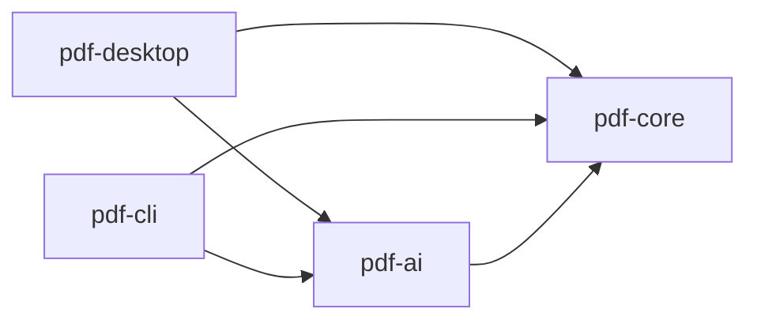

# pdfjig — 治具

PDF を「器」として扱うデスクトップユーティリティ。
複数の書類を綴じ、解き、中から情報を取り出す。**PDF の本文そのものは書き換えない。**

- ライセンス: Apache-2.0
- 対象プラットフォーム: Windows 10 / 11 (x64) — 初版
- 配布: GitHub Releases（jpackage による MSI / EXE）
- リポジトリ: https://github.com/propagandist/pdfjig

---

## 1. 設計思想

治具（じぐ）とは、加工物を正確な位置に固定し、同じ作業を誰がやっても同じ精度で繰り返せるようにする道具である。

このツールの設計原則もそれに従う。

1. **確定的処理が主、AI は従。** 座標・構造の解析は決定的アルゴリズムが行う。AI は意味的な整形を提案するだけで、確定的処理の結果を上書きする権限を持たない。
2. **AI は提案しかしない。** 分割・リネーム・整形はすべて「提案 → プレビュー → ユーザー承認 → 適用」の3段を経る。AI の出力が直接ファイルを変更する経路は存在しない。
3. **AI なしで完全に動く。** API キー未設定でも全機能が利用可能でなければならない。AI は増築であって土台ではない。
4. **中身は触らない。** ページの並べ替え・抽出・暗号化は行うが、PDF 本文のテキストやベクタ内容は改変しない。
5. **提案は、人が直せる面を通る。** 見せて「はい / いいえ」を取るだけでは承認にならない。中身を直せなければ、人にできるのは全部呑むか全部捨てるかだけである。一目では読めない量と構造——600 ページのしおり、300 件のリネーム——を、人が確かめて直せる面を持つ。

**5 は 2 の言い換えではない。** 2 が定めるのは順序（提案 → プレビュー → 承認 → 適用）で、5 が定めるのは**承認の中身**である。

**この面は、判断する側の道具には作れない。** MCP の elicitation は、仕様が「入れ子の構造と、列挙を超える配列は**意図して**扱わない」と定めている（form モード）。**しおりの木は原理的に載らない。** 仕様が用意した逃げ道は「サーバがページを配り、ブラウザで開かせる」形であり、それは**ポートを開けることを要求する**（§2.2 の Non-goal）。ホストが出すツール許可のダイアログも、**ツール呼び出しを承認するものであって結果を承認するものではない。**

**だからこの面は、利用者の手元で動くこのアプリが持つ。** ページの絵と並べて見せられるのも、部分的に却下できるのも、ここだけである。

---

## 2. スコープ

### 2.1 対象とするもの

| カテゴリ | 機能 |
|---|---|
| ページ操作 | 結合、分割、削除、並べ替え、回転、範囲抽出 |
| テキスト抽出 | 全文 / ページ単位 / 座標付き |
| 表抽出 | lattice・stream 両モード、矩形範囲指定 |
| 暗号化 | 設定、解除、判定、パスワード付きで開く |
| 文書情報 | メタデータ読み書き、ページ数、暗号化状態 |
| 文書の見出し | しおりの編集、ページラベルの設定 |
| 出力 | CSV（BOM付き UTF-8）/ JSON / XLSX |
| AI 補助 | 表の正規化、文書境界検出、リネーム・分類、OCR 誤字補正 |

### 2.2 Non-goals（明示的に対象外）

以下は **要望が来ても実装しない**。README に明記する。

- **PDF 本文のテキスト直接編集** — 設計思想 4 に反する
- **電子署名・タイムスタンプ** — PKI 基盤・証明書チェーン管理が必要になり、製品の性格が変わる。ただし **署名の有無は検知し、書き出しで無効になることを警告する**。付与も検証もしないが、既にあるものを黙って壊すのは別の話である
- **フォームの作成** — フォームへの入力・値の読み取りは将来検討の余地があるが、作成は対象外
- **PDF の生成・帳票出力** — 既存の帳票ツールの領域
- **全文 RAG チャット** — 汎用 LLM ツールの領域であり、デスクトップアプリの優位性がない

この線引きは初版リリース時点で確定させる。後から「方針変更」として説明する事態を避けるため、空リポジトリの段階で README に記載する。

**判断する側の道具へ開く口にも、同じ線を引く**（§1 の 5、§8 の M1.5）。

- **目次ページの生成** — PDF の生成である。しおりのすぐ隣にあるので、ここに線を引いておく
- **墨消しの実行** — 本文の改変（INV-4）。**塗り潰しの下のテキストは検出する。除去はしない**
- **HTTP トランスポート** — 利用者の PC でポートを開けない。stdio のみとする
- **中身を渡す口・ページ画像を返す口** — 判断する側は元の PDF をそのまま読める。**劣化した経路を優れた経路の代わりに差し出すことになる**（`CLAUDE.md` 優先順位 2、§5.4）
- **パスワードを受け取る口** — 引数は LLM を通る。**作らなければ INV-5 が自動的に守られる**
- **削除・上書きをする口** — 書き込みは必ず人の承認を通る（§1 の 5）

**★ この 6 件は README に書かない。** 上の 5 件と違い、**まだ配っていない口の話である。**
利用者から見た「実装しない機能」の一覧に混ぜると、**あるはずのものが無いと読める。**
配る版が決まったときに README へ移す。

---

## 3. アーキテクチャ

### 3.1 モジュール構成

```
pdfjig/
├── pdf-core/      確定的処理。PDFBox / tabula-java / POI
├── pdf-ai/        LLM プロバイダ抽象化。提案を返すのみ
├── pdf-cli/       バッチ / CI 連携
└── pdf-desktop/   JavaFX UI
```

依存の向き:



**不変条件: `pdf-core` は `pdf-ai` に依存してはならない。** これは Gradle の依存宣言と ArchUnit テストの双方で強制する。この依存方向が崩れると設計全体が意味を失う。

### 3.2 技術選定

| 領域 | 選定 | ライセンス | 理由 |
|---|---|---|---|
| 言語 | Java 21 | — | 既存資産との整合。record / sealed / pattern matching を活用 |
| ビルド | Gradle (Kotlin DSL) | — | マルチモジュール構成 |
| PDF 基盤 | Apache PDFBox 3.x | Apache-2.0 | ページ操作・テキスト抽出・暗号化 |
| 表抽出 | tabula-java | MIT | lattice / stream 両対応。代替となる成熟実装が存在しない |
| Excel 出力 | Apache POI (SXSSF) | Apache-2.0 | ストリーミング API。XSSF は OOM の原因になるため使用禁止 |
| UI | JavaFX 21 | GPL+CE | jpackage との親和性 |
| パッケージング | jpackage (JDK 標準) | — | JRE 同梱の MSI / EXE |

**iText は使用しない。** AGPL であり、Apache-2.0 での公開と両立しない。

**Tauri / .NET を採用しなかった理由:** 表抽出の成熟した実装が Java にしか存在しない。Rust の PDF エコシステム（lopdf, pdf-extract）は抽出用途で実用水準に達しておらず、.NET には tabula 相当が存在しない。自前実装すると工数の大半をそこに費やすことになる。

---

## 4. pdf-core API

### 4.1 主要型

```java
// 文書ハンドル。AutoCloseable。パスワードは char[] で受け取る
final class PdfDocument implements AutoCloseable {
    static PdfDocument open(Path path);
    static PdfDocument open(Path path, char[] password);
    int pageCount();
    EncryptionInfo encryption();
    DocumentMetadata metadata();
}

// 暗号化状態
record EncryptionInfo(
    boolean encrypted,
    EncryptionAlgorithm algorithm,   // NONE, RC4_40, RC4_128, AES_128, AES_256
    boolean userPasswordRequired,
    AccessPermissions permissions
) {}

// 権限フラグ
record AccessPermissions(
    boolean print,
    boolean modify,
    boolean extractContent,
    boolean modifyAnnotations,
    boolean fillForms,
    boolean assembleDocument,
    boolean extractForAccessibility,  // 既定 true。塞ぐと支援技術で読めなくなる
    boolean printHighQuality
) {}
```

### 4.2 操作

```java
interface PageOperations {
    Path merge(List<Path> inputs, Path output, MergeOptions opts);
    List<Path> split(Path input, SplitStrategy strategy, Path outputDir);
    Path reorder(Path input, List<Integer> newOrder, Path output);
    Path rotate(Path input, Map<Integer, Rotation> rotations, Path output);
    Path extractPages(Path input, PageRange range, Path output);
    Path deletePages(Path input, PageRange range, Path output);

    // 並べ替え・削除・回転を一度の書き出しで確定させる
    Path assemble(Path input, List<PageSelection> selections, Path output);

    // 複数のファイルにまたがって集める。sourceIndex が inputs の並びを指す
    Path assemble(List<Path> inputs, List<PageSelection> selections, Path output);

    // 組み立てた並びを、かたまりごとに連番で書き出す
    List<Path> assembleEach(List<Path> inputs, List<List<PageSelection>> segments, Path outputDir);
}

// 出力に含める 1 ページの指定
record PageSelection(
    int sourceIndex,             // 出どころ。inputs の添字（0 始まり）
    int pageNumber,              // その文書の中でのページ番号（1 始まり）
    Rotation additionalRotation  // 元の回転角に加える回転。絶対角ではない
) {}

interface TextExtraction {
    String extractAll(PdfDocument doc);
    List<PageText> extractByPage(PdfDocument doc);
    List<PositionedText> extractWithPositions(PdfDocument doc, int pageIndex);
}

interface TableExtraction {
    List<RawTable> extract(PdfDocument doc, PageRange range, TableMode mode);
    List<RawTable> extract(PdfDocument doc, int pageIndex, Rectangle2D area, TableMode mode);
}
// TableMode: LATTICE（罫線あり）, STREAM（罫線なし）, AUTO

interface Encryption {
    EncryptionInfo inspect(Path input);
    Path protect(Path input, char[] userPassword, char[] ownerPassword,
                 AccessPermissions permissions, EncryptionAlgorithm algorithm, Path output);
    Path unprotect(Path input, char[] password, Path output);
}

interface Exporter {
    void export(List<RawTable> tables, Path output, ExportFormat format);
}
// ExportFormat: CSV, JSON, XLSX
```

**`pdf-core` は既存の出力を拒む**（`ErrorCode.OUTPUT_ALREADY_EXISTS`）。上のすべてのシグネチャにかかる契約である。上書きの判断は利用者のものであり、暗黙に行わない。この規約により、入力と同じパスを出力に指定して入力を壊す事故も同時に防がれる。

**`pdf-desktop` の「名前を付けて保存」は、その上に層を重ねる。** ネイティブの保存ダイアログが上書きを利用者に確認し、確認が取れてから作業場所へ書いて入れ替える。**先に消すと、書き込みに失敗したときに元のファイルが失われる。**

★★ **入れ替えは「元をどけてから入れる」2 本の改名である**（#119）。出力先を**消さずに**作業場所へ改名して退避し、空いたところへ書けたものを入れる。**どちらも原子的な移動で頼む**（#113）。**これで「元も、置き換えるはずのものも無い」という状態がどの瞬間にも存在しない**——2 本の間で落ちても、元は作業場所の中に実体として残る。**2 本目に失敗したら 1 本目を巻き戻す。**

★ **素直に置き換えない理由は、いちばんありふれた経路がそれを断るからである。** Windows の置き換えは**置き換え先が開かれていると断り**、**画面から上書き保存するとき、それを開いているのは pdfjig 自身である**（描画がそのハンドルに依存しており、保存の間は閉じられない）。#113 はそこで 2 段の置き換えに落ちており、**「開いて、直して、同じ名前で保存する」だけが弱いまま残っていた。**

★★ **退避したものが残ることがある。** 巻き戻しにも失敗した場合と、2 本の間で落ちた場合である。そのとき**元の実体は作業場所（`.pdfjig-*`）の中にしか無く、出力先には何も無い。****次の書き出しはそれを消さない。****利用者から見える場所に残るが、失うよりはよい**（`CLAUDE.md` 優先順位 1）。下の「上書きを避けるための小細工はしない」との関係は、**退避は入れ替えの一部であって、成功すれば残らない**——恒久的なバックアップを作る話ではない。

★★ **残ったなら、その場所を画面で伝える**（#124）。失敗のダイアログに**控えの完全なパス**を出し、取り出して元の名前を付け直すよう促す。**伝えなければ、利用者から見えるのは「保存に失敗して、ファイルが消えた」だけである**——`.pdfjig-*` は**消してよいゴミにしか見えない**（`CLAUDE.md` 優先順位 2）。**ログには書かない**（§10.4 の★★が線を持つ）。

★★ **JVM ごと落ちた場合には届かない。** 電源断・強制終了・書き出し中の終了がそれに当たり、**控えは残るが誰も何も言わない。** 起動時に走査して拾う形は採らない——**出力先は利用者が選ぶ任意のフォルダであり、どこを走査してよいのか決まらない**（§10.1）。判断の経緯は `docs/HANDOVER.md`「決まったことの記録」にある。

★ **書けない出力先には手を出さない。** 改名は読み取り専用属性を無視して通るため、見ずに退避すると**利用者が読み取り専用にした文書が警告なく置き換わり、属性まで落ちる**（`CLAUDE.md` 優先順位 2）。**書けないと分かったら、退避を始める前に失敗させる。**

**分割は層を重ねず、`pdf-core` の約束のまま拒む**——複数のファイルを一度に作る操作であり、どれが置き換わるのかを 1 つずつ確認させる形にはしない。

**確認を出すのは OS のダイアログであり、pdfjig ではない。** したがって**上書き確認が出ていることを自動テストで確かめる手段が無い**（`FileDialogs` の向こう側。`CLAUDE.md`「JavaFX」）。人が見る手順の側に置いてある（`docs/HANDOVER.md` 4-4）。

**検査と書き出しの間の競合（TOCTOU）は見ない。** 既存かどうかを確かめてから書き出すまでの間に他のプロセスが作ったファイルは、黙って潰れる。`StandardOpenOption.CREATE_NEW` で原子的に弾く形は採っていない。**利用者の手元で動くデスクトップアプリであり、出力先を選ぶのも同じ利用者である**ため、そこは守る対象に入れない。この前提が変わるのは、`pdf-core` をライブラリとして publish したとき（§9）である。

**上書きを避けるための小細工はしない。** 連番（`foo(1).pdf`）への退避もバックアップ（`.bak`）の作成も行わない。

`assemble` は `reorder` / `rotate` / `extractPages` / `deletePages` を置き換えるものではない。単一の操作で済む経路はそれぞれの API を使う。

`assemble` が別に要るのは、UI が並べ替え・削除・回転を続けて行うためである。個別 API の連鎖で実装すると中間ファイルが要るうえ、途中で失敗したときに「並べ替えた状態で回転したら並べ替えが消えた文書が出てくる」ことになり、利用者を誤解させる（§1 の設計思想、`CLAUDE.md` 優先順位 2）。UI 上の編集結果は一度の書き出しで確定させる。

複数入力を取る `assemble` は、UI が開いている文書に他のファイルを足せるようにするためのものである（§7.1）。`merge` との違いはページ単位で順序と向きを指定できる点にあり、`merge` はファイル単位でつなぐ操作として残る。

`assembleEach` は、その組み立てた並びを**かたまりごとに**書き出す。**`split` との違いは、何を切るかにある**——`split` は**元の並び**を戦略（ページ数・範囲・境界）で切り、`assembleEach` は**呼び出し側が組み立てた並び**をそのまま切る。UI の「分割」が切りたいのは後者であり、並べ替えや削除を反映しない結果を渡すほうが惑わせる（`docs/HANDOVER.md`「分割を『ここで区切る』に変えた」）。`split` は §4.2 の API として残る——M2 の CLI と AI の境界検出は元の並びを切る側を使う。

**この 2 つが別の実装を持たない。** 出力名の付け方（`<最初の入力名>_001.pdf`）も、1 つでも書けないなら何も書かないという約束も、`pdf-core` の側だけが持つ。UI が同じものを写すと、同じ「分割」という操作の挙動が 2 か所に分かれ、**しかも違いは失敗したときにしか出ない**（#56）。

#### 4.2.1 書き出しで保たれるもの・失われるもの

ページを新しい文書に詰め替えると、ページに属さないものはすべて落ちる。しおり・フォームの入力値・添付ファイル・文書情報・ページラベル・タグ構造は、いずれもページではなく文書に属する。**出力が入力より劣化する経路を作らない**（`CLAUDE.md` 優先順位 1）ため、書き出しは可能な限り元の文書を保存する。

| 入力 | やり方 | 保たれるもの |
|---|---|---|
| 1 ファイル、同じページを二度使わない | 元の文書から要らないページを外して並べ替え、その文書を保存する | 文書レベルの構造すべて |
| 複数ファイル、または同じページを複数回 | 必要なページだけに切り詰めた複製を作り、結合する | しおり・フォーム・添付ファイル。文書情報は先頭の入力のもの（`Warning.METADATA_FROM_FIRST_INPUT`） |

UI の編集（並べ替え・削除・回転）は 1 ファイルを扱う限り上段に乗る。下段になるのは「PDF を追加」で他のファイルを混ぜた場合だけである。

**保てないものが 2 つある。**

- **暗号化** — 出力は平文になる（§4.3）。`Warning.ENCRYPTION_NOT_PROPAGATED`
- **電子署名** — ページの並びを変えれば必ず無効になる。署名は追記でしか保てず、並べ替えでは原理的に保てない。`Warning.SIGNATURE_INVALIDATED`

どちらも黙って行わない。

**出力に含まれないページを指す参照は、保存前に取り除く。** しおり・リンク注釈・名前付き宛先・開いたときの移動先が対象である。

これは体裁の整えではない。PDF の書き出しは **参照から辿り着けるものをすべて書く** ため、取り除かないと、捨てたページがページ一覧には出ないままファイルの中に残る。開いても枚数を数えても分からない。目次を持つ文書から機密ページを取り除いて渡す、という使い方で実害が出る。

宛先を失ったしおりは、宛先だけ外して残すのではなく **項目ごと取り除き、その子は繰り上げる**。押しても何も起きないしおりは、目次があるかのように見せかけるだけで害がある（`CLAUDE.md` 優先順位 2）。取り除いた場合は `Warning.DANGLING_REFERENCES_REMOVED` を発する。

#### 4.2.1.1 この一覧は、そのまま作る側の品目表でもある

上でしおり・フォームの入力値・添付ファイル・文書情報・ページラベル・タグ構造を数え上げたのは、書き出しで失わないためだった。**同じものが、実際の文書ではほぼ必ず空か間違っている。** スキャナは題名に `Scan_20260812_0034` としか書かない。

この層には共通の性質がある。

- **中身を読まないと正しい値が決まらない。** 決定的な道具では埋められない
- **正しい値さえ決まれば、書くのは決定的である。** そこは pdfjig の仕事になる
- **一目で確かめられる。** §1 の 5（人が直せる面）が効く形をしている
- **本文でもベクタでもない。** INV-4 に触れない

**INV-4 は制約であると同時に、輪郭でもあった。** 本文を触らないと決めたことで、pdfjig は「文書を説明し、道しるべを付ける層」に押し込まれている。そこはちょうど、現実の文書で最も壊れていて、直すのに読解が要り、直ったかが一目で分かる層である。

**★ ただし、数え上げた 6 つのうち書き換えてよいのは 3 つだけである**——しおり・文書情報・ページラベル。**それ以外は書き換えない。** 理由つきの表（正と負の両方、および出力に含めないページを指す参照という例外）は `CLAUDE.md` INV-4 が持つ。**ここへ写さない。**

### 4.3 暗号化の伝播

**結合・分割の出力は、既定で暗号化を引き継がない。**

暗号化された文書を分割したとき、出力が平文になるか元の保護を継承するかは PDFBox が自動的に決めてくれない。黙って平文で出力すると、利用者は保護されているつもりで機密文書を配布することになる。

したがって:

- `MergeOptions` / `SplitStrategy` に `EncryptionPropagation`（`NONE` / `INHERIT` / `PROMPT`）を持たせる
- 既定は `PROMPT`（UI）/ `NONE`（CLI、ただし警告を stderr に出力）
- 入力のいずれかが暗号化されていた場合、出力時に必ず警告を発する

### 4.4 CSV 出力の要件

日本の実務書類を CSV で出力する際、以下を満たさないと Excel で開いた瞬間にデータが壊れる。

- **BOM 付き UTF-8** で出力する（Shift_JIS 環境での文字化け対策）
- 先頭ゼロを含むセル（郵便番号、電話番号、品番、口座番号）の消失は CSV の限界であり回避不能。**XLSX 出力を推奨経路として UI に提示する**
- 日付への自動変換（`1-2` → `1月2日`）も同様

CSV は互換性のための選択肢であり、既定の出力形式は XLSX とする。

---

## 5. pdf-ai

### 5.1 原則

- すべてのメソッドは **提案（Proposal）** を返す。ファイルを変更しない。
- LLM に渡すのは **抽出済みテキストのみ**。PDF バイナリやページ画像は渡さない（トークンが破綻する）。**★ これは pdfjig 自身の経路にかかる規律であって、モデルが何を見るかの保証ではない**——MCP モードではホストが自分でページを描いて読む（§5.4）。**「pdfjig を使えばモデルはページを見ない」と読ませないこと**
- 出力は JSON Schema で強制し、パース失敗時は確定的処理の結果にフォールバックする。
- 文書境界検出はページ単位の分類タスクに落とす。全ページを一度に投げない。

### 5.2 インタフェース

```java
interface AiProvider {
    boolean isAvailable();

    Proposal<NormalizedTable> normalizeTable(RawTable table);
    Proposal<List<BoundaryCandidate>> detectBoundaries(List<PageText> pages);
    Proposal<String> proposeFileName(DocumentText text, NamingConvention convention);
    Proposal<String> correctOcrErrors(String ocrText);
}

record Proposal<T>(
    T value,
    double confidence,
    String rationale,
    List<Change> changes   // 元データとの差分。UI の差分表示に使う
) {}
```

### 5.3 実装

| 実装 | 用途 |
|---|---|
| `NoOpProvider` | **既定**。`isAvailable()` は false。全メソッドは空の Proposal を返す |
| `AnthropicProvider` | BYOK。Claude API |
| `OpenAiProvider` | BYOK |
| `OllamaProvider` | ローカル実行 |

**Ollama 対応は付け足しではなく必須機能である。** 請求書・作業報告書・契約書といった書類は、クラウド API への送信自体が社内規程で禁止されている現場が珍しくない。ローカルモデルで動くという一点がこのツールの実用性を大きく左右する。表の正規化と文書分類程度であれば 7B〜14B クラスで十分実用に乗る。

### 5.4 文書がどこへ出るか

**使われ方は 3 つあり、文書の行き先が違う。混ぜて説明すると「便利だが誤解を招く」になる**（`CLAUDE.md` 優先順位 2）。

| モード | 判断するのは | pdfjig 自身の外向き通信 | 文書はどこまで出るか |
|---|---|---|---|
| **MCP モード** | 利用者が既に開いている LLM ホスト | **無い**（stdio のみ） | **既にホストへ渡っている。** pdfjig は秘匿を足さない |
| **Ollama モード** | 手元のモデル | localhost のみ | **手元から出ない** |
| **BYOK モード** | クラウドの API | 有る | 抽出済みテキストが API へ出る |

**★ MCP モードで pdfjig が足すのは、手と窓であって秘匿ではない。** 「ローカル完結」を謳えるのは Ollama モードだけである。

**★ ただし「プライバシーの話が無い」わけでもない。** 利用者は pdfjig が無くてもホストに PDF を読ませる。pdfjig の道具は**渡す量を減らす側**にあるので、**取るはずだった行動と比べれば出る量は減る。**

**この関係は、道具が中身を返し始めた瞬間に逆転する。** 数百のファイルを横断して探す道具が一致したテキストまで返せば、**利用者が開いてもいない文書から中身を吸い出す**ことになる。**返すのはパスとヒット件数までとし、開くかどうかは 1 件ずつ決めさせる**（§2.2 の Non-goal、`SECURITY.md`「対象範囲」）。

---

## 6. パスワードの取り扱い

機能そのものより神経を使う領域。以下は **すべて必須要件** とする。

- **`String` ではなく `char[]` で保持し、使用後に `Arrays.fill(pw, '\0')` でゼロ埋めする。** String はインターン領域に残り、ヒープダンプから回収される
- **CLI の引数で受け取らない。** `ps` や shell history から見える。標準入力、環境変数、ファイル参照のいずれかに限定する
- **設定ファイルに保存しない。** バッチ処理で使い回す場合もセッション中のメモリ保持に留める
- **例外メッセージとログに載せない。** PDFBox の例外をそのまま再スローすると混入する可能性がある。必ずラップして再構築する
- **UI では `PasswordField` を使い、確認用の再入力欄を設ける**（打ち間違いで開けない文書ができあがるため）

### 6.1 権限フラグに関する UI 上の注意喚起

PDF には役割の異なる 2 つのパスワードがある。

| | ユーザーパスワード | オーナーパスワード |
|---|---|---|
| 用途 | 文書を開く | 権限を変更する |
| 実効性 | 本物の暗号化 | 権限フラグの保護のみ |

**印刷禁止・コピー禁止といった権限フラグは暗号学的に強制されない。** ユーザーパスワードが空の場合、PDF の中身は暗号化されておらず、権限フラグは閲覧ソフトが自主的に従っているだけの申告制である。PDFBox を含む任意のライブラリで無視できる。

これは PDF 仕様上の設計であって実装の不備ではないが、利用者はほぼ確実に「コピー禁止にしたから安全」と誤解する。

**要件:** オーナーパスワードのみを設定しようとした際、UI に「この設定は閲覧ソフトの自主的な遵守に依存します。確実に保護するにはユーザーパスワードを設定してください」と明示する。

### 6.2 既定値

- 暗号強度の既定は **AES-256（PDF 2.0 / Revision 6）**。RC4 系と AES-128 は互換性が必要な場合のみの選択肢とし、既定にはしない
- `extractForAccessibility` は **既定で許可**。これを塞ぐと視覚障害者が読めなくなる
- UI では「印刷を許可」「テキスト抽出を許可」「編集を許可」の 3 つに束ねたプリセットと、8 フラグすべての詳細展開の 2 段構成とする

---

## 7. UI 要件（pdf-desktop）

### 7.1 M0 で必須のもの

**サムネイル一覧とドラッグ&ドロップ並べ替えは M0 の必須要件である。**

ページ操作をリスト表示（「1ページ目」「2ページ目」）でやるなら、pdftk や qpdf をコマンドで叩くのと情報量が変わらない。デスクトップアプリが既存 CLI に対して持つ唯一の優位性はページが見えることであり、それを外すと GUI の皮をかぶった劣化 CLI になる。

| 実装する | 実装しない |
|---|---|
| 固定サイズのサムネイル一覧 | ズーム |
| スクロール時の遅延レンダリング | ページ拡大プレビュー |
| サムネイルの LRU キャッシュ | 複数文書の同時タブ |
| ドラッグ&ドロップ並べ替え | 開いている文書どうしのページ交換 |
| 1 つの編集セッションに複数ファイルのページを含めること | |

**「PDF を追加」で足したページは、元からあったページと区別なく扱う。** 当初は「文書間のページ移動」も実装しないとしていたが、それだと結合が「開いている文書とは無関係にファイルを選んで書き出す」一発勝負の操作にしかならず、他の操作と流れが揃わない。綴じる道具としての中心的な操作であり、方針を改めた。

区別しているのは、複数の文書を**別々に開いて**行き来することである。タブや複数ウィンドウは持たない。あくまで 1 つの編集セッションが複数ファイルのページを含み、出力も 1 つになる。

### 7.2 スレッド規約

`PDFRenderer` の呼び出しは **必ずバックグラウンドスレッドで行う**。JavaFX Application Thread では、レンダリング済み `Image` の差し込みだけを行う。ここを同期でやると 100 ページの PDF を開いた瞬間に UI が固まる。

### 7.3 AI 提案の承認フロー

AI 機能が有効な場合、提案は必ず以下の順を踏む。

1. 提案の生成（バックグラウンド）
2. 差分表示（元の値と提案値を並べる。`Proposal.changes` を使う）
3. 個別またはまとめての承認 / 却下
4. 承認されたものだけを適用

「すべて自動適用」のオプションは提供しない。

---

## 8. フェーズ

| | 内容 | AI |
|---|---|---|
| **M0** | ページ操作（結合・分割・削除・並べ替え・回転・範囲抽出）、テキスト抽出、サムネイル UI | なし |
| **M1** | 表抽出、出力 3 形式、暗号化機能一式、`AiProvider` 抽象化（Anthropic + Ollama + NoOp）、表の正規化 | 導入 |
| **M1.5** | 文書レベルの構造の編集（しおり・文書情報・ページラベル）と、それを人が直せる面。続いて判断する側へ開く口（stdio） | 窓 |
| **M2** | 文書境界検出、リネーム・分類、バッチ処理、CLI 公開 | 拡張 |
| **M3** | OCR 対応、誤字補正 | 拡張 |

**★ 番号を振り直していない。** M0〜M3 は `docs/HANDOVER.md` とマイルストーンの description が番号で参照している。振り直すと、指している先が黙って別のものになる。**M1.5 は M1 の途中に入る**——実際に配る順序は版（マイルストーン）が持ち、期はそれをまたぐ（#26）。

**M1.5 の前半（編集の面）は M1 の表抽出より前に配る。** 理由は「表抽出の前提が変わったから」**ではない**。罫線のある表を tabula が座標ごと決定的に読むことは変わらず、ページを読むモデルの出力は**照合する先が無いので検算できない**——優先順位 1（データを壊さない）の下で、検算できないものを主たる抽出器にはできない。**両者は競合ではなく住み分けであり、tabula の役割は縮まない。**

**前に置くのは、M1.5 の前半が新しい依存を 1 つも足さず、既にある土台の上に乗るからである。** しおりの木を読んで組み直す処理は書き出しの側に既にあり（§4.2.1）、テストのフィクスチャも揃っている。対して表抽出は tabula と POI を戻す（SBOM が 64 から約 120 になる）。

**後半（開く口）にはマイルストーンを付けていない。** 判断する側の道具を持つ人と、200 枚をスキャンする現場の人は今のところ重なっておらず、**時期はタイミングへの賭けになる。** 前半は AI が 1 行も無くても完結する機能なので、**配って反応を見てから決める。**

**M0 の時点で単体のツールとしてリリース可能な状態にする。** AI 機能が存在しない状態でも実用に耐えることを、リリース履歴として残す。これが OSS としての信頼性を左右する。

暗号化機能を M1 に置くのは、「パスワード付き PDF を開けない」ままだと表抽出機能そのものが実務で使えない場面が出てくるため。暗号化解除・判定・設定はセットで実装したほうが結局早い。

---

## 9. 配布

- **Maven Central は初版では使用しない。** pdfjig はライブラリではなくアプリケーションであり、Maven Central は用途が合わない
- GitHub Releases に jpackage の成果物（MSI / EXE）を置く。CI でビルドしてリリースに添付するところまで自動化する
- `pdf-core` を他プロジェクトから使いたいという要望が実際に出た段階で公開を検討する。その際の groupId は **`io.github.propagandist`** とする（GitHub アカウントの所有確認だけで通り、ドメイン所有証明が不要）
- `io.github.*` は GitHub アカウントに紐づくため、事前に押さえておく必要はない

---

## 10. 利用者の PC に置くもの

**置き場は `%LOCALAPPDATA%\pdfjig\` である。**

```
%LOCALAPPDATA%\pdfjig\
  settings.properties     設定（実装済み）
  logs\                   ログ（実装済み。§10.4）
    pdfjig.0.0.log          現行。古いものが pdfjig.0.1.log → pdfjig.0.2.log と下がる
    pdfjig.0.0.log.lck      書き込み中の目印。FileHandler が作る
                            ★ 頭の 0 はプロセスの番号。2 つ目の窓が同時に動くと 1 になる
  proposals\              提案の受け渡し（未実装。§8 の M1.5 の後半）
```

**★ `%APPDATA%`（ローミング）ではない。** ここに置くのは**パス**であり、ローミングプロファイルは別のマシンへ運ばれる。`D:\scan\` は運んだ先に無いので、**運べば必ず外れる値を運ぶことになる**。ローミングは容量に上限を掛けられる運用も多く、ログを同じ木に置くとそこにも効く。EXE の入れ先も `%LOCALAPPDATA%` である（`--win-per-user-install`）ため、入れ物と持ち物が同じ木に揃う。

**`%LOCALAPPDATA%` を持たない環境では、何も置かず何も読まない。** Windows 以外がそれに当たる。**覚えられないことは、動かない理由ではない。**

### 10.1 何を置き、何を置かないか

| 置く | 置かない |
|---|---|
| ダイアログを始めるフォルダ（読む用・書く用の 2 つ） | **パスワード**（INV-5。設定ファイルもログも平文で、消えずに残る） |
| 失敗したことの記録（§10.4） | **開いていた文書のパス**——次の起動で勝手に読み込む形になり、**利用者が開くと決めていないものを開く** |
| | **文書のパスとファイル名**。設定に置かないものが、ログの側から入らないようにする（§10.4） |
| | PDF の中身。抽出したテキスト。サムネイル |

**増やすときは、この表に先に足す。** 何を覚えているかは、**利用者が確かめられる状態を保つ**（`CLAUDE.md` 優先順位 2）。形式を `Properties` の text（UTF-8）にしているのは、**開いて読めることを優先した**ためである。

### 10.2 壊れていたら捨てる。書けなければ諦める

**読めない・壊れている設定は捨てて既定に戻る。例外を投げない。**
**設定が壊れているせいでアプリが起動しない、という形を作らない。**

**書けなくても諦める。** 覚えているのは次にダイアログが開くフォルダだけで、失われても選び直せば済む。**閉じる操作を失敗させるほどのものではない。**

**書くのは終了時に一度だけである。** 異常終了すると失われる。

**書き方は、同じフォルダに一時ファイルを作ってから置き換える。** 名前だけ先に決めて直接書くと、書いている途中で終了したときに壊れたファイルが残る（`docs/HANDOVER.md` の #53 と同じ判断）。

**知らない鍵は消さない。** 新しい版が足した項目を、古い版が黙って捨てない。

### 10.3 アンインストールしても消えない

**MSI / EXE のアンインストーラはこの木を消さない。** jpackage が作るアンインストーラが消すのは入れたものだけであり、**動かしてから作られたものは残る。**

**これは意図した挙動である**——入れ直すたびに覚えたことが消えるほうが不便である。**中身は上の表のとおりで、いつ消してもよい。** 消せば次の起動が既定に戻るだけである。

### 10.4 ログ

**配布物には標準エラー出力が無い。** `jpackage` は `--win-console` を付けずに GUI アプリとして固めるため、**異常終了しても手がかりが 1 つも残らない**。ログはそのための置き場である。

**★ 操作の履歴ではない。** 書くのは `WARNING` 以上、つまり**失敗したことだけ**である。**正常に動いている限りファイルは作られない**——最初の 1 件が出るまで開かないので、何も起きていない利用者の PC には `logs\` フォルダそのものが無い。中身の無いファイルを置かないのは §10.2 と同じ判断である。

#### 何を書き、何を書かないか

| 書く | 書かない |
|---|---|
| 事象の名前と説明（`SETTINGS_UNWRITABLE 設定を書けなかった`） | **文書のパスとファイル名。** §10.1 が設定に置かないと決めたものが、ここから入らないようにする |
| 例外の**型名**とスタックフレーム | **例外のメッセージ**——`NoSuchFileException` のメッセージは**パスそのもの**である |
| `PdfjigException` の `ErrorCode` と原因の型名（あちらは入力値を持たないことが保証されている） | **パスワード**（INV-5）。上の 2 つを守れば入る経路が無い |
| 版数・Java / JavaFX の版・OS（見出しに 1 度） | PDF の中身。抽出したテキスト |

**★★ この表が掛かるのは「残り続ける記録」に対してである。** ここが守っているのは、**利用者の PC に残り、不具合の報告に貼られるファイル**の中身である。

**★ 外れるのは「文書のパスとファイル名」の 1 行だけである。** その場限りのダイアログには出してよい——閉じれば消え、出す先は利用者自身が選んだ場所であり、**伝えなければ取り戻す手立てが無い場合がある**（§4.2 の控えの在り処。`CLAUDE.md` 優先順位 2）。

**★★ 他の行は画面にも掛かる。** **パスワード**（INV-5）も**例外のメッセージ**も、**ログにも画面にも出さない**——依存ライブラリの例外には入力値が埋め込まれていることがあり、そこにパスワードが混ざりうる。画面へ出してよいのは `ErrorCode` の定型文だけである（`Messages#describe`。`MessagesTest` が丸ごと一致で縛っている）。**この但し書きをここ以外へ写さない。**

**★ 守り方は型に落としてある。** ログの口は `LogEvent`（列挙）しか受け取らない——**自由な文字列を渡せないので、呼ぶ側がうっかりパスを載せられない**。`java.util.logging` を直に触ることは ArchUnit が禁じており、**口を迂回できない**。

**★ 見出しに「何を書いていないか」を書く。** 不具合の報告に貼る人が、伏せ字にする手間をかけずに済む——**載っていないことがその場で読める**（`CLAUDE.md` 優先順位 2）。

**1 つの例外について書くフレームは 40 まで。** 超えたぶんは数を添えて省く。上限を置かないと、`StackOverflowError`（1000 を超えるフレームを持ち、**まさにここへ来る種類である**）1 件が世代を丸ごと押し出し、**押し出されるのはその直前に起きた本当の原因のほうになる**。

#### どれだけ残すか

**512 KB を 3 世代。** 現行が `pdfjig.0.0.log` で、いっぱいになると古いものが `pdfjig.0.1.log` → `pdfjig.0.2.log` と下がり、3 つ目は捨てる。

**合計は 1.5 MB を少し超える。** 上限を見るのは 1 件を書き終えてからなので、どの世代も最後の 1 件ぶんだけはみ出す。**「超えない」とは書かない**——実際に守れない数字を書くと、次に読む者がそれを根拠に何かを決める。

**★ 名前の頭の数字はプロセスの番号である。** この道具は 2 つ目の窓を止めていないので、同時に動けば 2 つ目は `pdfjig.1.0.log` へ書く。**番号を名前に持たせていないと、`FileHandler` は末尾へ `.1` を継ぎ足す**（`pdfjig.0.log.1`）——**上の木に無いファイルができ、落ちた報告を受けて現行のログを開いた人が「何も記録されていない」と読む。**

**書けなければ諦める。例外を投げない。** 一度失敗したら同じセッションでは試し直さない——書けない理由（権限・ディスク）はその間に変わらないことが多く、**記録を残そうとして遅くなる**ほうが害になる。

**消してよい。** 次に失敗が起きたとき作り直す。§10.3 のとおりアンインストールでも残る。

---

## 11. 更新の確認

**修正版を出しても、既に入れた利用者の手元にそれが届く経路が無かった**（#72）。v0.1.0 は書き出しの欠陥を抱えたまま配られ、修正版が出ても手元の版は何も知らないままだった。**見る側は 2 段そろっている**（依存の CVE は Dependabot、配布物の古さは週次の watch）**のに、届ける側が 0 段だった。**

### 11.1 押したときだけ外へ出る

**バージョン情報のダイアログの「更新を確認」を押したときに限り、GitHub へ 1 度だけ問い合わせる。** 起動時には何もしない。

**★ 想定利用者はクラウド送信が社内規程で禁じられている現場を含む**（§5.3）。**既定で外へ出ないことが、この機能を入れられる唯一の条件である。**「既定 OFF の自動確認」も同じ結果を得られるが、**説明が「設定によっては起動ごとに出る」になり、覚えておく状態も増える。**「押したときだけ問い合わせる」は 1 文で言い切れて、嘘になりにくい。

**覚えておく状態を持たない。**「この版はスキップ」も「次から確認しない」も無いので、§10 の設定ファイルに項目が増えない。

### 11.2 何を送り、何を受け取るか

| | |
|---|---|
| 送り先 | `https://github.com/propagandist/pdfjig/releases/latest` |
| 方法 | `HEAD`。リダイレクトを追わず、302 の `Location` だけを読む |
| 送るもの | **要求そのもの以外に何も載せない。** 文書もそのパスも送らない。**User-Agent も空にする**——載せると、どの版が何台あるかが GitHub 側に残る |
| 受け取るもの | `Location` の 1 行。本文（18KB の HTML）は読まない |

**★ API（`api.github.com`）を使わない。** 未認証の rate limit が **IP あたり 60 req/h** であり、**いちばん届けたい層——情報システム部門が MSI で一括配布した現場——は NAT の内側で 1 つの外向き IP を共有する。** リダイレクト方式にこの制約は無い。JSON の解析が要らない点も同じ側にある（JDK に JSON パーサは無く、足せば配布物と CVE を見る対象が増える）。

**★ 落とさない。実行しない。** 新しい版があれば版数を出し、Releases へのリンクを既定のブラウザへ渡すところで終わる。**無署名の実行物をアプリが落として起動する形は取らない。**

### 11.3 確かめられなくても、何も壊れない

**失敗はすべて「更新を確認できませんでした」の 1 行にする。** 遮断・DNS 不達・証明書・応答の形違い——**理由で分けない。利用者にできることは同じである。** 例外を投げない。

**★ 確認できなかったことは記録に残す**（§10.4 の `UPDATE_NOT_CHECKED`）。画面に出るのは 1 行だけなので、**「押しても何も起きない」という報告を受けたときに読む側の手がかりがそこにしか無い。** **例外にならない失敗も残す**——通信はできたが返ってきたものが想定と違う場合であり、**TLS を傍受するプロキシやログインページへ 302 を返すキャプティブポータルの内側がそれに当たる。そこはまさに届けたい層の環境である。**

**待たされる上限は決まっていない。** 接続と読み取りに 5 秒ずつ置いてあるが、**名前解決はその外である**——`HttpURLConnection` は解決してからでないと接続を始められない。**「合わせて 10 秒」とは書かない**（§10.4 の世代数と同じ判断。実際に守れない数字を書くと、次に読む者がそれを根拠に何かを決める）。**通信は背景スレッドで走るので、待っている間も窓は固まらない。**

**版数が読めなければ、問い合わせもしない。** `BuildInfo.version()` が `unknown` を返すのは焼き込みが壊れているときで、**比べられない答えのために外へ出る理由が無い。**

**比べるのは数値 3 つだけである。** `0.1.2-SNAPSHOT` のような接尾辞に順序を与えない——**代わりに、開発版を「最新です」とは答えない**（`CLAUDE.md` 優先順位 2）。

| 手元の版 | 出るもの |
|---|---|
| 公開されている最新より古い | 新しい版の版数と、Releases へのリンク |
| 最新と同じか、それより先 | 最新である旨 |
| 開発版で、公開されている最新より古くない | **開発版である旨**と、公開されている最新の版数 |
| 読めない・問い合わせに失敗した | 確認できなかった旨（1 行） |

### 11.4 これがアプリの唯一の外向き通信である

**pdf-desktop で `java.net` / `javax.net` の通信 API を触ってよいのは `UpdateCheck` だけである。** ArchUnit が縛っている（`desktopReachesTheNetworkOnlyThroughUpdateCheck`）。**`README.md` が公開している約束は、経路の数でしか確かめられない。**

**`java.net.URL` だけは型で縛れない**——JavaFX がスタイルシートを URL の文字列で受け取るためである。**入口の `URL#openStream` を名指しで塞いである**（`urlMustNotBeOpenedDirectly`）。

**pdf-core は引き続き一切通信しない**（`CLAUDE.md`「モジュール別の責務」）。**この機能は pdf-desktop に閉じている。**
